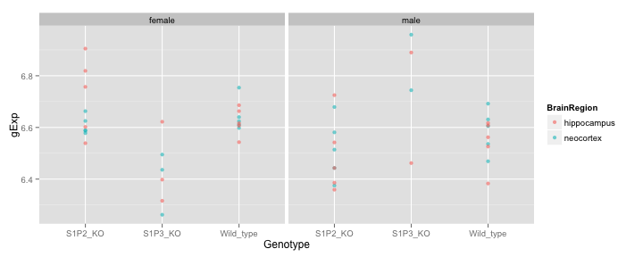
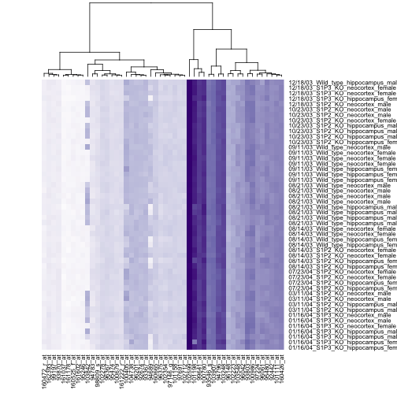

Assignment 1
========================================================

Wen Si (Sibyl) Gao

### Intro ###

This analysis is based on publicly-available expression study of mouse brain tissue with single gene mutation (http://www.ncbi.nlm.nih.gov/geo/query/acc.cgi?acc=GSE7191). 

S1P2, when mutated, results in seizures. While mutated S1P3, a related gene, does not. In this study, gene expression of two brain regions (hippocampus and neocortex) from three mouse strains (wild type, S1P2 mutant, and S1P3 mutant) are measured. Additional information of gender of the mice and processing date is available in the data being analyzed.

Expression is measured on the Affymetrix MGU74Av2 platform.

```r
library(plyr)
library(ggplot2)
library(xtable)
```


```r
design <- read.table("../data/mouseBrain/GSE7191-design.txt",
                     row.names=1, header=TRUE)
expDat <- read.table("../data/mouseBrain/GSE7191-data.txt",
                     row.name="probe", header=TRUE)

# order expression data columns (samples) by the rows in the design table
expDat <- expDat[, row.names(design)]
```


### Q1) Basic Characteristics ###

#### a) Dimensionality of the data

```r
dim(expDat)  # [probes, samples]
```

```
[1] 12422    50
```

```r
dim(design)  # [samples, design factors]
```

```
[1] 50  4
```

```r
fa <- colnames(design) # design factors
```


#### b) Factors in experimental design

Looking at each factor individually, samples are mostly evenly distributed across different levels of a factor. The exception is that there is smaller sample size for S1P3 knockout group.


```r
with(design, table(Genotype))
```

```
Genotype
  S1P2_KO   S1P3_KO Wild_type 
       20        10        20 
```

```r
with(design, table(BrainRegion))
```

```
BrainRegion
hippocampus   neocortex 
         25          25 
```

```r
with(design, table(Sex))
```

```
Sex
female   male 
    26     24 
```

```r
with(design, table(DateRun))
```

```
DateRun
01/16/04 03/11/04 07/23/04 08/14/03 08/21/03 09/11/03 10/23/03 12/18/03 
       7        4        4        8        8        7        7        5 
```


Cross-tabulating genotype and brain region also finds no issue with the factorial experimental design. As sample sizes are relatively even across all genotype-brain region cobminations (besides the issue of fewer S1P3 knockouts):


```r
x <- with(design, table(BrainRegion, Genotype))
html_print(addmargins(x))
```

<!-- html table generated in R 3.0.2 by xtable 1.7-1 package -->
<!-- Sat Feb 22 20:18:14 2014 -->
<TABLE border=1>
<TR> <TH>  </TH> <TH> S1P2_KO </TH> <TH> S1P3_KO </TH> <TH> Wild_type </TH> <TH> Sum </TH>  </TR>
  <TR> <TD align="right"> hippocampus </TD> <TD align="right"> 10 </TD> <TD align="right"> 5 </TD> <TD align="right"> 10 </TD> <TD align="right"> 25 </TD> </TR>
  <TR> <TD align="right"> neocortex </TD> <TD align="right"> 10 </TD> <TD align="right"> 5 </TD> <TD align="right"> 10 </TD> <TD align="right"> 25 </TD> </TR>
  <TR> <TD align="right"> Sum </TD> <TD align="right"> 20 </TD> <TD align="right"> 10 </TD> <TD align="right"> 20 </TD> <TD align="right"> 50 </TD> </TR>
   </TABLE>


Even as the gender of the mouse is taken into account. The design seem okay:

```r
x <- with(design, table(Sex, BrainRegion, Genotype))
ftable(x)
```

```
                   Genotype S1P2_KO S1P3_KO Wild_type
Sex    BrainRegion                                   
female hippocampus                5       3         5
       neocortex                  5       3         5
male   hippocampus                5       2         5
       neocortex                  5       2         5
```


Problem seem to appear when examining DateRun as a factor. DateRun could potentially confound both Genotype and gender of the mouse. It is often the case that a single day contains only samples of the same genotype and samples of the same gender. As a result, one may not know if different expression readings is due to different genotypes, or different dates the sample is run. It's the same case with gender of the mouse. If DateRun (the batch effect) is an important factor of the expression readings, one has to correct for this effect. 


```r
x <- with(design, table(Genotype, DateRun))
ftable(x)
```

```
          DateRun 01/16/04 03/11/04 07/23/04 08/14/03 08/21/03 09/11/03 10/23/03 12/18/03
Genotype                                                                                 
S1P2_KO                  0        4        4        4        0        0        7        1
S1P3_KO                  7        0        0        0        0        0        0        3
Wild_type                0        0        0        4        8        7        0        1
```

```r
x <- with(design, table(Genotype, DateRun))
ftable(x)
```

```
          DateRun 01/16/04 03/11/04 07/23/04 08/14/03 08/21/03 09/11/03 10/23/03 12/18/03
Genotype                                                                                 
S1P2_KO                  0        4        4        4        0        0        7        1
S1P3_KO                  7        0        0        0        0        0        0        3
Wild_type                0        0        0        4        8        7        0        1
```


#### c) Explore differenitial readings on one probe

I decided to examining the readings of the probe for S1P2 (S1pr2). The probe for S1P2 is 99372_at on this platform.


```r
(theProbe <- which(row.names(expDat) == '99372_at'))
```

```
[1] 11958
```

```r
pDat <- data.frame(design, gExp = unlist(expDat[theProbe, ]))

ggplot(pDat, aes(x=Genotype, y=gExp, color=BrainRegion)) + geom_point(alpha=0.6) + facet_grid(.~Sex)
```

 


Clearly something isn't right here. The probe reading of S1P2 in the S1P2 knockout group is supposed to decrease, yet the reading is the same or even higher there than that in the wildtype. 

#### d) Differential readings on one probe (numeric)


```r
pMean <- aggregate(gExp ~ Genotype + BrainRegion + Sex, pDat, FUN = mean)
x <- xtabs(gExp~BrainRegion+Sex+Genotype,pMean)
ftable(x)
```

```
                   Genotype S1P2_KO S1P3_KO Wild_type
BrainRegion Sex                                      
hippocampus female            6.724   6.445     6.623
            male              6.491   6.676     6.539
neocortex   female            6.608   6.398     6.645
            male              6.518   6.851     6.587
```

```r
# html_print(pMean, digits=3)
```


```r
plot(cars)
```

 


