Assignment 1
========================================================

Wen Si (Sibyl) Gao

### Intro ###

This analysis is based on publicly-available expression study of mouse brain tissue with single gene mutation (http://www.ncbi.nlm.nih.gov/geo/query/acc.cgi?acc=GSE7191). 

S1P2, when mutated, results in seizures. While mutated S1P3, a related gene, does not. In this study, gene expression of two brain regions (hippocampus and neocortex) from three mouse strains (wild type, S1P2 mutant, and S1P3 mutant) are measured. Additional information of gender of the mice and processing date is available in the data being analyzed.

Expression is measured on the Affymetrix MG_U74Av2 platform.

```r
library(plyr)
library(ggplot2)
library(xtable)
library(RColorBrewer)
library(gplots)
```

```
## KernSmooth 2.23 loaded
## Copyright M. P. Wand 1997-2009
## 
## Attaching package: 'gplots'
## 
## The following object is masked from 'package:stats':
## 
##     lowess
```

```r
library(preprocessCore)
library(reshape)
```

```
## 
## Attaching package: 'reshape'
## 
## The following objects are masked from 'package:plyr':
## 
##     rename, round_any
```

```r
library(limma)
```


```r
design <- read.table("../data/mouseBrain/GSE7191-design.txt",
                     row.names=1, header=TRUE)
expDat <- read.table("../data/mouseBrain/GSE7191-data.txt",
                     row.name="probe", header=TRUE)
design$Sid <- rownames(design)

# order expression data columns (samples) by the rows in the design table
expDat <- expDat[, row.names(design)]
```


```r
# Reorder Genotype factor levels so that wildtype has level 1
design$Genotype <- 
  factor(design$Genotype, levels=c("Wild_type","S1P2_KO","S1P3_KO"))
```


```r
# create new factor for DateRun
# levels are order by increasing date, and labeled by "Day-1", etc
newDateRun <- with(design, {
  dates <- as.Date(levels(design$DateRun),"%m/%d/%y")
  nfDateRun <- factor(DateRun, levels(DateRun)[order(dates)])
  levels(nfDateRun) <- paste("Day", 1:nlevels(DateRun), sep="-") 
  return(nfDateRun)
})
design$DateRun <- newDateRun

# more informative column names for expDat
colnames(expDat) <- 
  with(design, paste(DateRun, 
                     substr(Genotype,1,4), 
                     substr(BrainRegion,1,4), 
                     substr(Sex,1,1), Sid,
                     sep="_"))

# define sample order
sampleOrd <- with(design, order(DateRun, Genotype, BrainRegion, Sex))
expDat <- expDat[,sampleOrd]
design <- design[sampleOrd,]
```


### Q1) Basic Characteristics ###

#### a) Dimensionality of the data

```r
dim(expDat)  # [probes, samples]
```

```
[1] 12422    50
```

```r
dim(design)  # [samples, design factors]
```

```
[1] 50  5
```

```r
fa <- colnames(design) # design factors
```


#### b) Factors in experimental design

Looking at each factor individually, samples are mostly evenly distributed across different levels of a factor. The exception is that there is smaller sample size for S1P3 knockout group.


```r
with(design, table(Genotype))
```

```
Genotype
Wild_type   S1P2_KO   S1P3_KO 
       20        20        10 
```

```r
with(design, table(BrainRegion))
```

```
BrainRegion
hippocampus   neocortex 
         25          25 
```

```r
with(design, table(Sex))
```

```
Sex
female   male 
    26     24 
```

```r
with(design, table(DateRun))
```

```
DateRun
Day-1 Day-2 Day-3 Day-4 Day-5 Day-6 Day-7 Day-8 
    8     8     7     7     5     7     4     4 
```


Cross-tabulating genotype and brain region also finds no issue with the factorial experimental design. As sample sizes are relatively even across all genotype-brain region cobminations (besides the issue of fewer S1P3 knockouts):


```r
x <- with(design, table(BrainRegion, Genotype))
html_print(addmargins(x))
```

<!-- html table generated in R 3.0.2 by xtable 1.7-1 package -->
<!-- Wed Feb 26 05:14:12 2014 -->
<TABLE border=1>
<TR> <TH>  </TH> <TH> Wild_type </TH> <TH> S1P2_KO </TH> <TH> S1P3_KO </TH> <TH> Sum </TH>  </TR>
  <TR> <TD align="right"> hippocampus </TD> <TD align="right"> 10 </TD> <TD align="right"> 10 </TD> <TD align="right"> 5 </TD> <TD align="right"> 25 </TD> </TR>
  <TR> <TD align="right"> neocortex </TD> <TD align="right"> 10 </TD> <TD align="right"> 10 </TD> <TD align="right"> 5 </TD> <TD align="right"> 25 </TD> </TR>
  <TR> <TD align="right"> Sum </TD> <TD align="right"> 20 </TD> <TD align="right"> 20 </TD> <TD align="right"> 10 </TD> <TD align="right"> 50 </TD> </TR>
   </TABLE>


Even as the gender of the mouse is taken into account. The design seem okay:

```r
x <- with(design, table(Sex, BrainRegion, Genotype))
ftable(x)
```

```
                   Genotype Wild_type S1P2_KO S1P3_KO
Sex    BrainRegion                                   
female hippocampus                  5       5       3
       neocortex                    5       5       3
male   hippocampus                  5       5       2
       neocortex                    5       5       2
```


Problem seem to appear when examining DateRun as a factor. DateRun could potentially confound both Genotype and gender of the mouse. It is often the case that a single day contains only samples of the same genotype and samples of the same gender. As a result, one may not know if different expression readings is due to different genotypes, or different dates the sample is run. It's the same case with gender of the mouse. If DateRun (the batch effect) is an important factor of the expression readings, one has to correct for this effect. 


```r
x <- with(design, table(Genotype, DateRun))
ftable(x)
```

```
          DateRun Day-1 Day-2 Day-3 Day-4 Day-5 Day-6 Day-7 Day-8
Genotype                                                         
Wild_type             4     8     7     0     1     0     0     0
S1P2_KO               4     0     0     7     1     0     4     4
S1P3_KO               0     0     0     0     3     7     0     0
```

```r
x <- with(design, table(Genotype, DateRun))
ftable(x)
```

```
          DateRun Day-1 Day-2 Day-3 Day-4 Day-5 Day-6 Day-7 Day-8
Genotype                                                         
Wild_type             4     8     7     0     1     0     0     0
S1P2_KO               4     0     0     7     1     0     4     4
S1P3_KO               0     0     0     0     3     7     0     0
```


#### c) Explore differenitial readings on one probe

I decided to examining the readings of the probe for S1P2 (S1pr2). The probe for S1P2 is 99372_at on this platform.


```r
extractByProbe <- function(eDat, probeId, eDesign=design){
  (theProbe <- which(row.names(eDat) == probeId))
  pDat <- data.frame(eDesign, gExp = unlist(eDat[theProbe, ]))
  return(pDat)
}

plotDiffExp <- function(pDat){
  p <- ggplot(pDat, aes(x=Genotype, y=gExp, color=Sex)) + 
      geom_point(alpha=0.6) + 
      facet_grid(.~BrainRegion)
  return(p)
}

pDat <- extractByProbe(expDat, '99372_at')
plotDiffExp(pDat)
```

 


Clearly something isn't right here. The probe reading of S1P2 in the S1P2 knockout group is supposed to decrease, yet the reading is the same or even higher there than that in the wildtype. 

#### d) Differential readings on one probe (numeric)


```r
# compute mean expression at each combination of Genetype, BrainRegion and Sex
pMean <- aggregate(gExp ~ Genotype + BrainRegion + Sex, pDat, FUN = mean)

# display the result in wide form
x <- xtabs(gExp~BrainRegion+Sex+Genotype,pMean)
ftable(x)
```

```
                   Genotype Wild_type S1P2_KO S1P3_KO
BrainRegion Sex                                      
hippocampus female              6.623   6.724   6.445
            male                6.539   6.491   6.676
neocortex   female              6.645   6.608   6.398
            male                6.587   6.518   6.851
```


### Q2 Examine the sample correlation matrix

#### a)


```r
# creating some color palette
jPurplesFun <- colorRampPalette(brewer.pal(n = 9, "Purples"))
jGreysFun <- colorRampPalette(brewer.pal(n = 9, "Greys"))
```


```r
sampleCor <- cor(expDat)

myheatmap <- function(sampleCor, ...){
  heatmap.2(sampleCor, 
            Rowv = FALSE, dendrogram="none",
            symm=TRUE, margins=c(10,10),
            trace="none", scale="none", col = jGreysFun(256))
}
myheatmap(sampleCor)
```

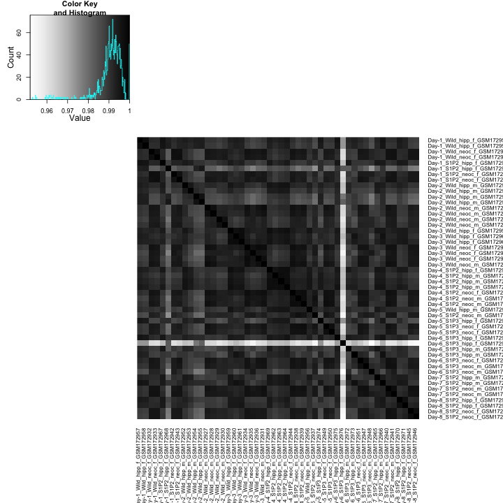 


b) Outlier sample

To show how the outlier stands out visually, I computed the mean correlation for each row. And display the distribution of the means using a density plot.

```r
meanCor <- rowMeans(sampleCor)
ggplot(data.frame(meanCor=meanCor),
       aes(x=meanCor)) +
  geom_bar(alpha=0.5)
```

```
stat_bin: binwidth defaulted to range/30. Use 'binwidth = x' to adjust this.
```

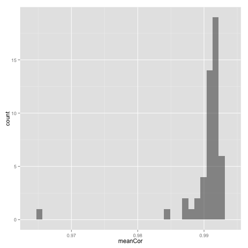 

```r

outlierIdx <- which(meanCor==min(meanCor))
(outlierName <- names(outlierIdx))
```

```
[1] "Day-6_S1P3_hipp_f_GSM172976"
```


Numerically, I computed the rank sum test to show that the correlation involving outlier sample has a different mean from those not involving the outlier sample. I suppose I have to assume independence between all these correlation coefficeints which obviously isn't true, but maybe I can be sloppy here... 


### 3  Normalization 

#### a) Prior to normalization


```r
# elongate <- function(hDat){
#   sampleName <- factor(colnames(eDat))
#   ldply(hDat, summarize){
# #     print(dim(x))
# #     print(names(x))
# #     return(data.frame(gExp=x, sampleName=x))
#   })
# }
```


```r
# set.seed(540)
# hSize <- 2000
# theseProbes <- sample(1:nrow(expDat), hSize)
# expDat2 <- expDat[theseProbes,]
# expDat2 <- expDat

sampleBoxplot <- function(eDat){
  
  # create long format of the expression data, 
  # better suited for plotting
  longExpDat <- 
    melt(cbind(eDat, probe=rownames(eDat)), 'probe')
  
  longExpDat <- 
    rename(longExpDat, 
           c("variable"="SampleName", "value"="gExp"))

  p <- ggplot(longExpDat, 
            aes(SampleName, gExp, color=SampleName==outlierName))
  p <- p + geom_boxplot()
  return(p)
}

sampleBoxplot(expDat)
```

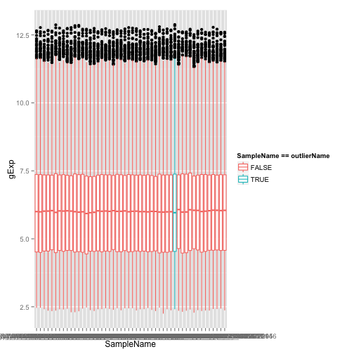 


```r

myNormalize <- function(eDat){
  neDat <- normalize.quantiles(as.matrix(eDat))
  neDat <- data.frame(neDat)
  rownames(neDat) <- rownames(eDat)
  colnames(neDat) <- colnames(eDat) 
  return(neDat)
}

nExpDat <- myNormalize(expDat)
sampleBoxplot(nExpDat)
```

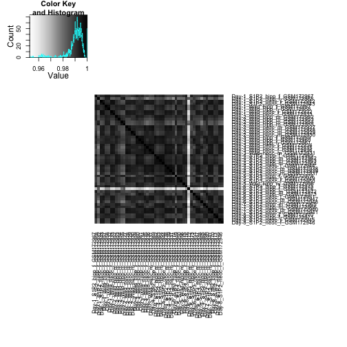 


#### b) With normalization alone

```r
myheatmap(cor(nExpDat))
```

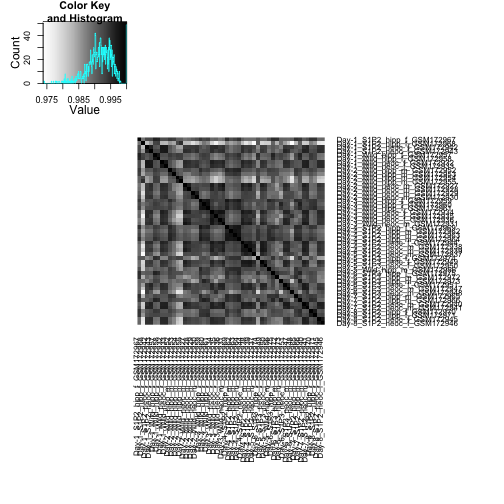 


#### c-e) With outlier removed and quantile normalization

```r
nrExpDat <- expDat[, colnames(expDat) != outlierName]
nrExpDat <- myNormalize(nrExpDat)
nrDes <- design[-c(outlierIdx),]
myheatmap(cor(nrExpDat))
```

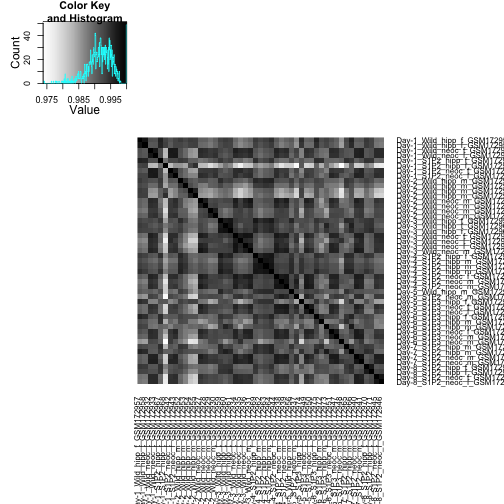 

```r
sampleBoxplot(nrExpDat)
```

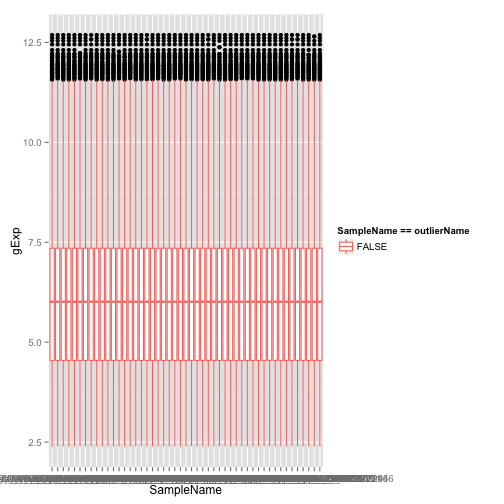 


```r
plotDiffExp(extractByProbe(nrExpDat, '99372_at', nrDes))
```

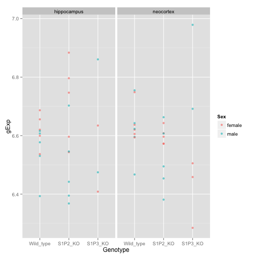 

```r
plotDiffExp(miniDat <- extractByProbe(nrExpDat, '92352_at', nrDes))
```

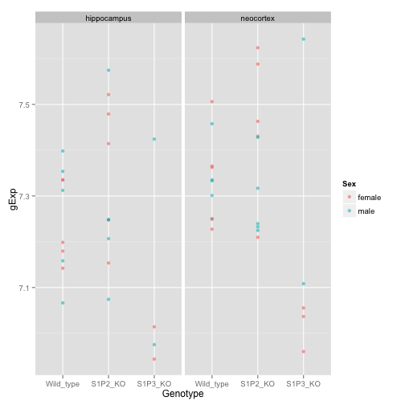 

### 4 Differential expression across genotypes (within neocortex brain region)

a)


```r
isNc <- nrDes$BrainRegion == "neocortex"
ncDes <- subset(design, subset=isNc)
ncDat <- subset(nrExpDat, select=isNc )
```


```r
ncDesMat <- model.matrix(~Genotype, ncDes)
ncFit <- lmFit(ncDat, ncDesMat)
ncEbFit <- eBayes(ncFit)
koHits <- topTable(ncEbFit, number=50,
                   coef = grep("KO", colnames(coef(ncEbFit))))
```


#### b)

```r
hitsExp <- ncDat[rownames(koHits), order(ncDes$Genotype)]
heatmap.2(as.matrix(hitsExp), 
          Colv = NA, Rowv = NA, scale="none", trace="none",
          margins = c(12, 10), col = jGreysFun(256))
```

```
Warning: Discrepancy: Rowv is FALSE, while dendrogram is `both'. Omitting row dendogram.
Warning: Discrepancy: Colv is FALSE, while dendrogram is `none'. Omitting column dendogram.
```

 


#### c)

```r
threshold <- 1e-4
cnt <- sum(koHits$P.Value < threshold)
```

The number of hits with p-value smaller than 10<sup>-4</sup> is cnt.

Computing FDR using q-value (adj.P.Val)

```r
q <- tail(koHits, n=1)$adj.P.Val # FDR of hits
eFP <- nrow(koHits) * q # expected # FD
# P <- nrow(koHits)
# FDR <- eFP / P
```


d)

```r
interesting <- rownames(head(koHits,3))
for (pb in interesting){
  print(plotDiffExp(extractByProbe(nrExpDat, pb, nrDes)))
}
```

 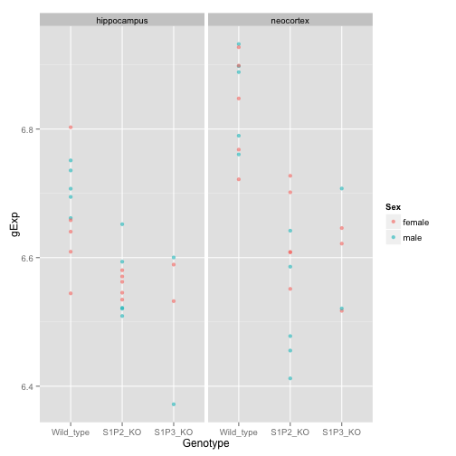 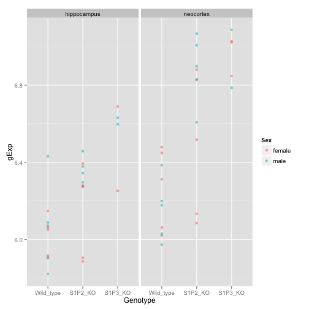 


```r
set.seed(540)
boringIdx <- sample(which(rownames(ncDat) %in% rownames(koHits)),3)
boring <- rownames(ncDat)[boringIdx]
for (pb in boring){
  print(plotDiffExp(extractByProbe(nrExpDat, pb, nrDes)))
}
```

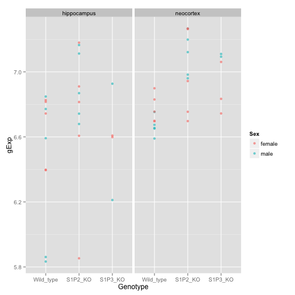 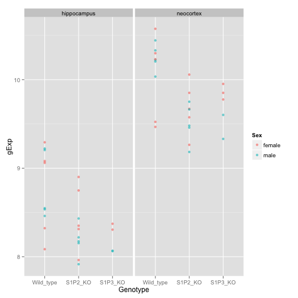 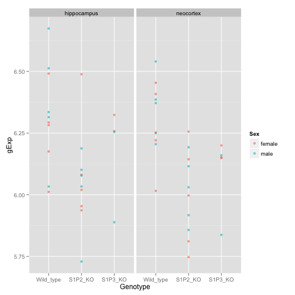 

e)

```r
s1p3KOHits <- topTable(ncEbFit, p.value=0.1, number=Inf,
                   coef = grep("S1P3_KO", colnames(coef(ncEbFit))))
nrow(s1p3KOHits)
```

```
[1] 61
```


```r
#aFit <- lm(gExp ~ Genotype, miniDat, subset=(BrainRegion=="neocortex"))
# lmFit <- adply(head(nrExpDat), 1, function(x, eDesign){
#   rowname(x)
#   pDat <- data.frame(eDesign, gExp = unlist(x))
#   fit <- lm(gExp ~ Genotype, pDat, subset=(BrainRegion=="neocortex"))
#   return(pDat)
# }
```


```r
#heatmap(expDat, Rowv = NA, Colv = NA, scale="none", margins = c(5, 8), col = jBuPuFun(256))
# set.seed(540)
# hSize <- 200
# theseProbes <- sample(1:nrow(expDat), hSize)
# hDat <- expDat[theseProbes, sampleOrd]
# hDat <- as.matrix(hDat)
# colnames(hDat) <- with(design[sampleOrd,],
#                        paste(DateRun, Genotype, BrainRegion, Sex, sep="_"))
# 
# 
# jPurplesFun <- colorRampPalette(brewer.pal(n = 9, "Purples"))
# heatmap(hDat, Colv = NA, Rowv = NA, scale=c("column"), 
#         margins = c(5, 8), col = jPurplesFun(256))
```


