Assignment 1
========================================================

Wen Si (Sibyl) Gao

### Intro ###

This analysis is based on publicly-available expression study of mouse brain tissue with single gene mutation (http://www.ncbi.nlm.nih.gov/geo/query/acc.cgi?acc=GSE7191). 

S1P2, when mutated, results in seizures. While mutated S1P3, a related gene, does not. In this study, gene expression of two brain regions (hippocampus and neocortex) from three mouse strains (wild type, S1P2 mutant, and S1P3 mutant) are measured. Additional information of gender of the mice and processing date is available in the data being analyzed.

Expression is measured on the Affymetrix MG_U74Av2 platform.

```r
library(plyr)
library(ggplot2)
library(lattice)
library(xtable)
library(RColorBrewer)
library(gplots, warn.conflicts = FALSE)
```

```
## KernSmooth 2.23 loaded
## Copyright M. P. Wand 1997-2009
```

```r
library(preprocessCore)  # to help normalization
library(reshape, warn.conflicts = FALSE)
library(limma)
library(MIfuns, warn.conflicts = FALSE, quietly = TRUE)  # to help print ftable
```

```
## MIfuns 5.1
```


```r
design <- read.table("../data/mouseBrain/GSE7191-design.txt",
                     row.names=1, header=TRUE)
expDat <- read.table("../data/mouseBrain/GSE7191-data.txt",
                     row.name="probe", header=TRUE)
design$Sid <- factor(rownames(design))

# order expression data columns (samples) by the rows in the design table
expDat <- expDat[, row.names(design)]
```


```r
# Reorder Genotype factor levels so that wildtype has level 1
design$Genotype <- 
  factor(design$Genotype, levels=c("Wild_type","S1P2_KO","S1P3_KO"))
```


```r
# create new factor for DateRun
# levels are order by increasing date, and labeled by "Day-1", etc
newDateRun <- with(design, {
  ## Reorder DateRun levels
  dates <- as.Date(levels(DateRun),"%m/%d/%y")
  newDateLevels <- levels(DateRun)[order(dates)]
  nfDateRun <- factor(DateRun, newDateLevels)
  
  ## Re-label DateRun level labels
  levels(nfDateRun) <- paste("Day", 1:nlevels(DateRun), sep="-") 
  return(nfDateRun)
})
design$DateRun <- newDateRun

# more informative column names for expDat
colnames(expDat) <- 
  with(design, paste(DateRun, 
                     substr(Genotype,1,4), 
                     substr(BrainRegion,1,4), 
                     substr(Sex,1,1), Sid,
                     sep="_"))

# define sample order
sampleOrd <- with(design, order(DateRun, Genotype, BrainRegion, Sex))
expDat <- expDat[,sampleOrd]
design <- design[sampleOrd,]
```


### Q1 **(2 points)** What are the basic characteristics of the data and meta-data? 

#### Q1a: How many probes? How many samples?


```r
dim(expDat)  # [probes, samples]
```

```
[1] 12422    50
```

```r
dim(design)  # [samples, design factors]
```

```
[1] 50  5
```

```r
fa <- colnames(design) # design factors
```


There are 12422 probes and 50 samples.

#### b) Factors in experimental design

#### Q1b: What is the breakdown of samples for Genotype, BrainRegion, Sex, and DateRun?

For starters, cross-tabulate Genotype and BrainRegion. Then do some cross tabulation involving DateRun and, optionally, Sex to investigate if these "nuisance" factors are confounded with the experimental factors. Make sure you've included counts for all 4 individual factors somewhere, even if it's just in the margins of a cross-tabulation. How do you feel about the experimental design? 

Looking at each factor individually, 


```r
with(design, table(Genotype))
```

```
Genotype
Wild_type   S1P2_KO   S1P3_KO 
       20        20        10 
```

```r
with(design, table(BrainRegion))
```

```
BrainRegion
hippocampus   neocortex 
         25          25 
```

```r
with(design, table(Sex))
```

```
Sex
female   male 
    26     24 
```

```r
with(design, table(DateRun))
```

```
DateRun
Day-1 Day-2 Day-3 Day-4 Day-5 Day-6 Day-7 Day-8 
    8     8     7     7     5     7     4     4 
```


samples are mostly evenly distributed across different levels of a factor. The exception is that there is smaller sample size for S1P3 knockout group.

Cross-tabulating genotype and brain region:


```r
x <- with(design, table(BrainRegion, Genotype))
html_print(addmargins(x))
```

<!-- html table generated in R 3.0.2 by xtable 1.7-1 package -->
<!-- Fri Feb 28 16:07:45 2014 -->
<TABLE border=1>
<TR> <TH>  </TH> <TH> Wild_type </TH> <TH> S1P2_KO </TH> <TH> S1P3_KO </TH> <TH> Sum </TH>  </TR>
  <TR> <TD align="right"> hippocampus </TD> <TD align="right"> 10 </TD> <TD align="right"> 10 </TD> <TD align="right"> 5 </TD> <TD align="right"> 25 </TD> </TR>
  <TR> <TD align="right"> neocortex </TD> <TD align="right"> 10 </TD> <TD align="right"> 10 </TD> <TD align="right"> 5 </TD> <TD align="right"> 25 </TD> </TR>
  <TR> <TD align="right"> Sum </TD> <TD align="right"> 20 </TD> <TD align="right"> 20 </TD> <TD align="right"> 10 </TD> <TD align="right"> 50 </TD> </TR>
   </TABLE>


also finds no issue with the factorial experimental design. As sample sizes are relatively even across all genotype-brain region cobminations (besides the issue of fewer S1P3 knockouts).

Even as the gender of the mouse is taken into account. The design seem okay:


```r
x <- with(design, table(Sex, BrainRegion, Genotype))
html_print(ftable(x))
```

<!-- html table generated in R 3.0.2 by xtable 1.7-1 package -->
<!-- Fri Feb 28 16:07:45 2014 -->
<TABLE border=1>
<TR> <TH>  </TH> <TH>        </TH> <TH>             </TH> <TH> Genotype </TH> <TH> Wild_type </TH> <TH> S1P2_KO </TH> <TH> S1P3_KO </TH>  </TR>
  <TR> <TD align="right"> 1 </TD> <TD> Sex    </TD> <TD> BrainRegion </TD> <TD>          </TD> <TD>           </TD> <TD>         </TD> <TD>         </TD> </TR>
  <TR> <TD align="right"> 2 </TD> <TD> female </TD> <TD> hippocampus </TD> <TD>          </TD> <TD>         5 </TD> <TD>       5 </TD> <TD>       3 </TD> </TR>
  <TR> <TD align="right"> 3 </TD> <TD>        </TD> <TD> neocortex   </TD> <TD>          </TD> <TD>         5 </TD> <TD>       5 </TD> <TD>       3 </TD> </TR>
  <TR> <TD align="right"> 4 </TD> <TD> male   </TD> <TD> hippocampus </TD> <TD>          </TD> <TD>         5 </TD> <TD>       5 </TD> <TD>       2 </TD> </TR>
  <TR> <TD align="right"> 5 </TD> <TD>        </TD> <TD> neocortex   </TD> <TD>          </TD> <TD>         5 </TD> <TD>       5 </TD> <TD>       2 </TD> </TR>
   </TABLE>


Cross-tabulating DateRun and Genotype:


```r
x <- with(design, table(Genotype, DateRun))
html_print(ftable(x))
```

<!-- html table generated in R 3.0.2 by xtable 1.7-1 package -->
<!-- Fri Feb 28 16:07:45 2014 -->
<TABLE border=1>
<TR> <TH>  </TH> <TH>           </TH> <TH> DateRun </TH> <TH> Day-1 </TH> <TH> Day-2 </TH> <TH> Day-3 </TH> <TH> Day-4 </TH> <TH> Day-5 </TH> <TH> Day-6 </TH> <TH> Day-7 </TH> <TH> Day-8 </TH>  </TR>
  <TR> <TD align="right"> 1 </TD> <TD> Genotype  </TD> <TD>         </TD> <TD>       </TD> <TD>       </TD> <TD>       </TD> <TD>       </TD> <TD>       </TD> <TD>       </TD> <TD>       </TD> <TD>       </TD> </TR>
  <TR> <TD align="right"> 2 </TD> <TD> Wild_type </TD> <TD>         </TD> <TD>     4 </TD> <TD>     8 </TD> <TD>     7 </TD> <TD>     0 </TD> <TD>     1 </TD> <TD>     0 </TD> <TD>     0 </TD> <TD>     0 </TD> </TR>
  <TR> <TD align="right"> 3 </TD> <TD> S1P2_KO   </TD> <TD>         </TD> <TD>     4 </TD> <TD>     0 </TD> <TD>     0 </TD> <TD>     7 </TD> <TD>     1 </TD> <TD>     0 </TD> <TD>     4 </TD> <TD>     4 </TD> </TR>
  <TR> <TD align="right"> 4 </TD> <TD> S1P3_KO   </TD> <TD>         </TD> <TD>     0 </TD> <TD>     0 </TD> <TD>     0 </TD> <TD>     0 </TD> <TD>     3 </TD> <TD>     7 </TD> <TD>     0 </TD> <TD>     0 </TD> </TR>
   </TABLE>


Problem seem to appear when examining DateRun as a factor. DateRun could potentially confound both Genotype and gender of the mouse. It is often the case that a single day contains only samples of the same genotype and samples of the same gender. As a result, one may not know if different expression readings is due to different genotypes, or different dates the sample is run. It's the same case with gender of the mouse. If DateRun (the batch effect) is an important factor of the expression readings, one has to correct for this effect. 


#### Q1c: Create a plot showing the gene expression data for one probe.

Use position, panels or facets, and color to convey the Genotype, BrainRegion, and Sex of the samples.

I decided to examining the readings of the probe for S1P2 (S1pr2). The probe for S1P2 is 99372_at on this platform.


```r
extractByProbe <- function(eDat, probeId, eDesign=design){
  (theProbe <- which(row.names(eDat) == probeId))
  pDat <- data.frame(eDesign, gExp = unlist(eDat[theProbe, ]))
  return(pDat)
}

plotDiffExp <- function(pDat){
  p <- ggplot(pDat, 
              aes(x=Genotype, y=gExp, 
                  group=BrainRegion, color=BrainRegion, shape=Sex)) + 
      geom_point(alpha=0.6, size=3) + 
      geom_smooth(method=loess, se=F)
  return(p)
}

pDat <- extractByProbe(expDat, '99372_at')
plotDiffExp(pDat) + facet_grid(.~Sex)
```

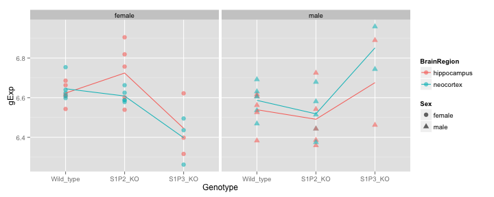 


Clearly something isn't right here. The probe reading of S1P2 in the S1P2 knockout group is supposed to decrease, yet the reading is the same or even higher there than that in the wildtype. 

#### Q1d: Report the average expression of the selected probe for all possible combinations of Genotype, BrainRegion and Sex.


```r
# compute mean expression at each combination of Genetype, BrainRegion and Sex
pMean <- aggregate(gExp ~ Genotype + BrainRegion + Sex, pDat, FUN = mean)

# display the result in wide form
x <- xtabs(gExp~BrainRegion+Sex+Genotype, pMean)
html_print(ftable(x))
```

<!-- html table generated in R 3.0.2 by xtable 1.7-1 package -->
<!-- Fri Feb 28 16:07:46 2014 -->
<TABLE border=1>
<TR> <TH>  </TH> <TH>             </TH> <TH>        </TH> <TH> Genotype </TH> <TH> Wild_type </TH> <TH> S1P2_KO </TH> <TH> S1P3_KO </TH>  </TR>
  <TR> <TD align="right"> 1 </TD> <TD> BrainRegion </TD> <TD> Sex    </TD> <TD>          </TD> <TD>           </TD> <TD>         </TD> <TD>         </TD> </TR>
  <TR> <TD align="right"> 2 </TD> <TD> hippocampus </TD> <TD> female </TD> <TD>          </TD> <TD>     6.623 </TD> <TD>   6.724 </TD> <TD>   6.445 </TD> </TR>
  <TR> <TD align="right"> 3 </TD> <TD>             </TD> <TD> male   </TD> <TD>          </TD> <TD>     6.539 </TD> <TD>   6.491 </TD> <TD>   6.676 </TD> </TR>
  <TR> <TD align="right"> 4 </TD> <TD> neocortex   </TD> <TD> female </TD> <TD>          </TD> <TD>     6.645 </TD> <TD>   6.608 </TD> <TD>   6.398 </TD> </TR>
  <TR> <TD align="right"> 5 </TD> <TD>             </TD> <TD> male   </TD> <TD>          </TD> <TD>     6.587 </TD> <TD>   6.518 </TD> <TD>   6.851 </TD> </TR>
   </TABLE>


### Q2 **(4 points)** Examine the sample correlation matrix.

#### Q2a: Depict the sample-to-sample correlations in a heatmap.

During preprocessing, data has been order by run date; ties are broken by Genotype, subsequently by BrainRegion, and by Sex at the end.

Applying cor() and heatmap.2() to the correlation matrix of among these ordered samples


```r
# creating some color palette
jPurplesFun <- colorRampPalette(brewer.pal(n = 9, "Purples"))
jGreysFun <- colorRampPalette(brewer.pal(n = 9, "Greys"))

#fig.width=12, fig.height=12}
sampleCor <- cor(expDat)

myheatmap <- function(sampCor, ...){
  heatmap.2(sampCor, 
            Rowv = FALSE, dendrogram="none",
            symm=TRUE, margins=c(10,10),
            trace="none", scale="none", col = jGreysFun(256))
}
myheatmap(sampleCor)
```

 


What do you see about batch effects, outliers, etc.? 

Batch effect is not easy to check for this design. While samples measured on the same date have higher correlation than those measured between dates, similar samples are predominantly measured on the same date. It's unclear whether biological similarity between samples or batch effect produced the high correlation. However knowing that microarray study is often affected by batch effect, it is safer to assume these are due to batch effect than something biological.

An outlier is very noticeable among these samples by its reduced correlation to other samples. 


#### Q2b: Identify the outlier sample.

Try to go beyond merely "eyeballing" it, i.e. make a quantitative statement about how it "sticks out" from the other samples.

To show how the outlier stands out visually, I computed the mean correlation for each row. And display the distribution of the means using a density plot.

```r
meanCor <- rowMeans(sampleCor)
ggplot(data.frame(meanCor=meanCor),
       aes(x=meanCor)) +
  geom_bar(alpha=0.5)
```

```
stat_bin: binwidth defaulted to range/30. Use 'binwidth = x' to adjust this.
```

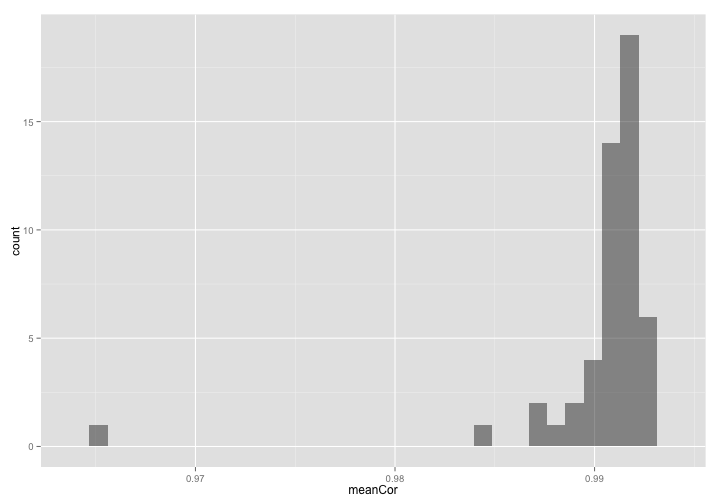 

```r

outlierIdx <- which(meanCor==min(meanCor))
(outlierName <- names(outlierIdx))
```

```
[1] "Day-6_S1P3_hipp_f_GSM172976"
```


#### Q2c: Examine the outlier in the context of its experimental group.

Which group is the outlier in, in terms of Genotype, BrainRegion, and Sex? 


```r

group.def <- c("Genotype", "BrainRegion", "Sex")
thisGroup <- design[outlierIdx, group.def]
```


Look for other member in the same group:

```r
isSameGroup <- function(x, y, group.def=TRUE){
  return(all(x[group.def] == y[group.def]))
}
members <- alply(design, 1, isSameGroup,
                   y=design[outlierIdx,], group.def=group.def)
members <- unlist(members)
colnames(expDat)[members]
```

```
[1] "Day-5_S1P3_hipp_f_GSM172974" "Day-6_S1P3_hipp_f_GSM172975"
[3] "Day-6_S1P3_hipp_f_GSM172976"
```


Scatter plot these samples against each other:


```r
sampLabels <- design$Sid
sampLabels <- mapvalues(sampLabels, from=sampLabels[outlierIdx], to="Outlier")
grpSamples <- expDat[, members]
colnames(grpSamples) <- sampLabels[members]
splom(grpSamples, panel = panel.smoothScatter)
```

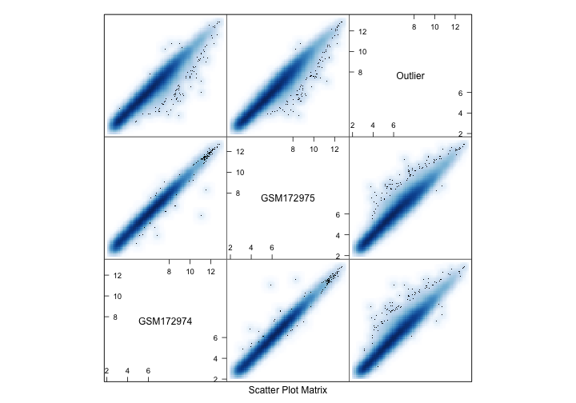 


Gene expression scatter plot involving the outlier spreads further away from the diagonal than plots only involvong non-outlier genes. This explains the lower correlation coefficiets. 


### Q3 **(4 points)** Normalization, what it can and can't do.

#### Q3a: Make boxplots.

Make a pair of plots: each plot will show gene expression boxplots, one per sample. Identify the outlier sample with a different color, if you can. 


  * The data as provided


```r
# set.seed(540)
# hSize <- 2000
# theseProbes <- sample(1:nrow(expDat), hSize)
# expDat2 <- expDat[theseProbes,]
# expDat2 <- expDat

sampleBoxplot <- function(eDat){
  
  # create long format of the expression data, 
  # better suited for plotting
  longExpDat <- 
    melt(cbind(eDat, probe=rownames(eDat)), 'probe')
  
  longExpDat <- 
    rename(longExpDat, 
           c("variable"="SampleName", "value"="gExp"))

  p <- ggplot(longExpDat, 
            aes(SampleName, gExp, color=SampleName==outlierName))
  p <- p + geom_boxplot()
  return(p)
}

sampleBoxplot(expDat)
```

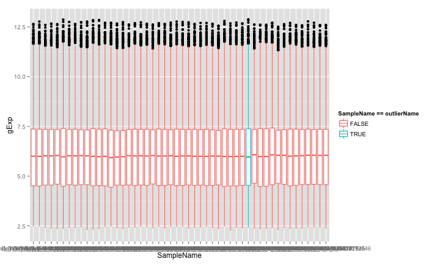 


Comment on these plots, in general and with respect to the outlier:

Each boxplot (gene expressions of a set) has similar but slightly different median and 1/4 th and 3/4 th percentile, which I assume are mostly resulted from batch effect. Interestingly, the center and the spread of the outlier sample doesn't seem very different from other samples. So the outlier is likely messed up in other ways without messing up its centre or spread.


Performing quantile normalization and redraw the boxplot

```r

myNormalize <- function(eDat){
  neDat <- normalize.quantiles(as.matrix(eDat))
  neDat <- data.frame(neDat)
  rownames(neDat) <- rownames(eDat)
  colnames(neDat) <- colnames(eDat) 
  return(neDat)
}

nExpDat <- myNormalize(expDat)
sampleBoxplot(nExpDat)
```

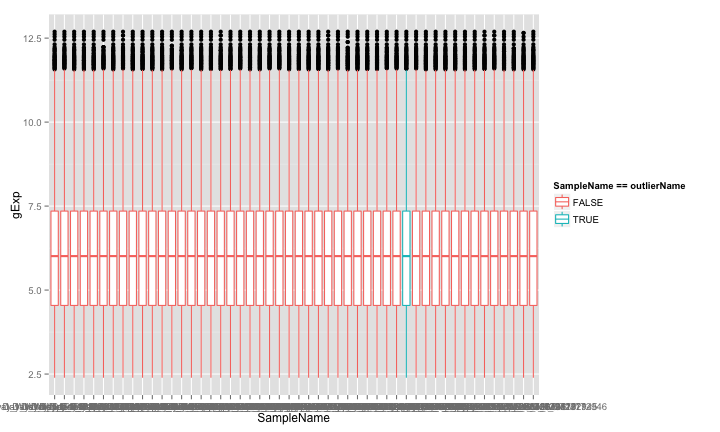 

These boxplots (including the one for the outlier) now have the same median and 1/4 th and 3/4 th percentile. The batch effect is minimized by this normalization step.

#### Q3b: Did normalization fix the outlier?

With the quantile-normalized data, re-make the heatmap of the sample correlation matrix and re-compare the outlier to its experimental group. 


```r
myheatmap(cor(nExpDat))
```

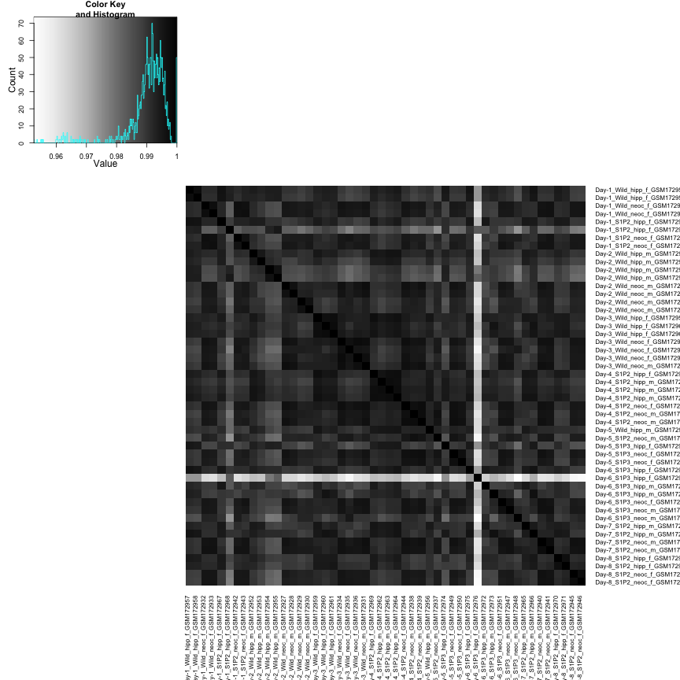 


Is everything OK now?

No, the heapmap hardly changed at all (though inspecting the value of the correlation matrix, I know that these values do change slightly). This is expected, as normalization that roughly preserves the relative position among data points should not have affect the correlation much.


#### Q3c: Form a dataset that omits the outlier and quantile normalize it.


```r
nrExpDat <- expDat[, colnames(expDat) != outlierName]
nrExpDat <- myNormalize(nrExpDat)
nrDes <- design[-c(outlierIdx),]
```


#### Q3d Re-make the heatmap of the sample correlation matrix, now that the worst outlier is gone. 


```r
myheatmap(cor(nrExpDat))
```

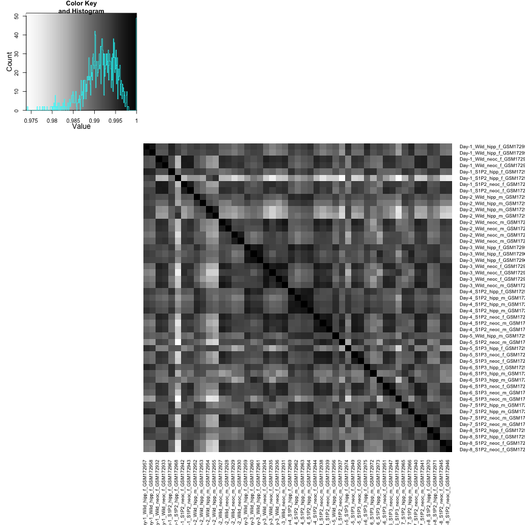 


The heatmap looks differently now, because the range of the correlation coefficients is narrower after outlier removal. Hence the same difference in correlation values are now described in more different colors.

#### Q3e: Remake the expression boxplots for all samples before moving on to differential expression analysis.


```r
sampleBoxplot(nrExpDat)
```

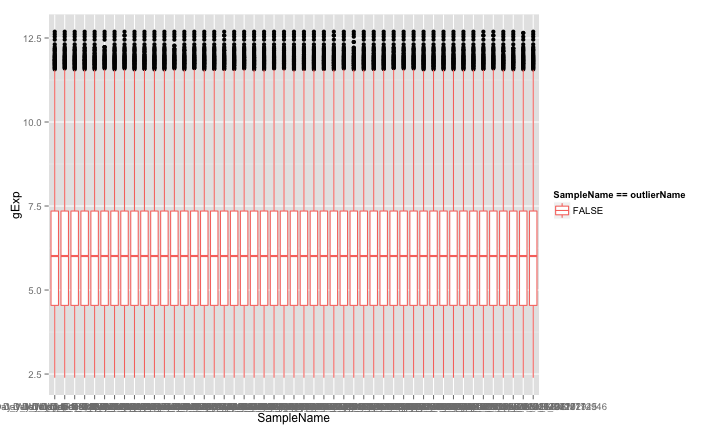 


49 samples remain. 


### Q4 **(5 points)** For each probe, test if it has differential expression across the three genotypes *within the neocortex brain region only*.

You should be using data with the worst outlier removed, after quantile normalization and, for this question, restricted to neocortex.


```r
isNc <- nrDes$BrainRegion == "neocortex"
ncDes <- subset(nrDes, subset=isNc)
ncDat <- subset(nrExpDat, select=isNc)
```


#### Q4a: Write out, in an equation or English or, ideally, both, the model you are fitting.

I am fitting a linear model to test whether any probe exhibits any difference between either wildtype and P1S2 knockout or between wildtype and S1P3 knockout. I do this while ignoring the potential effect of BrainRegion.


```r
ncDesMat <- model.matrix(~Genotype, ncDes)
ncFit <- lmFit(ncDat, ncDesMat)
ncEbFit <- eBayes(ncFit)
koFullTable <- topTable(ncEbFit, number=Inf, adjust.method="BH",
                        coef = grep("KO", colnames(coef(ncEbFit))))
```


In the context of that model, what statistical test(s) are you conducting? (You can gloss over the neocortex restriction here.) I am conducting an F test to test whether the two parameters (describing the diferences) are both 0.


#### Q4b: Explore your hits.

Display the expression data for the top 50 probes in a heat map. Order the probes by p-value; order the samples by genotype.


```r
koHits <- head(koFullTable, 50)
hitsExp <- ncDat[rownames(koHits), order(ncDes$Genotype)]
heatmap.2(as.matrix(hitsExp), 
          Colv = NA, Rowv = NA, scale="none", trace="none",
          margins = c(12, 10), col = jGreysFun(256))
```

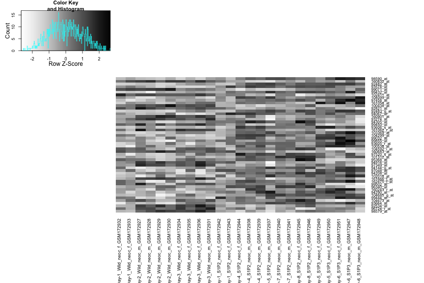 


#### Q4c: Count your hits.

How many probes have unadjusted p-value < 1e-3? 


```r
pMax <- 1e-3
# unadjTop <- topTable(ncEbFit, number=Inf, 
#                      adjust.method="none", p.value=pMax,
#                      coef = grep("KO", colnames(coef(ncEbFit))))

hitsByPval <- subset(koFullTable, P.Value < pMax)
```


The number of hits with p-value smaller than 0.001 is 
96.

If we took the top 50 probes as our "hits":

```r
#   topTable(ncEbFit, number=50, adjust.method="BH",
#                    coef = grep("KO", colnames(coef(ncEbFit))))
q <- tail(koHits, n=1)$adj.P.Val # FDR of hits
eFP <- nrow(koHits) * q # expected # FD
```


What is the (estimated) false discovery rate? The estimated FDR is 0.0759, by the definition q-value that aims to find the ratio false discoveries out of significant responses.

How many of these hits do we expect to be false discoveries? The expected false discoveries among the hits is 3.7968.

#### Q4d: Plot the gene expression data for a few top hits and a few boring probes.


```r
# selecting interesting and boring probes
n <- 3 
intrProbes <- rownames(head(koFullTable, n))
borProbes <- rownames(tail(koFullTable, n))

multiProbeExtract <- function(probesL, xDat, xDes, status){
  multiProbeDat <- ldply(probesL, function(jProbe){
    data <- extractByProbe(xDat, jProbe, xDes)
    data$status <- factor(status)
    data$probe <- factor(jProbe)
    return(data)
  })
}

intDat <- multiProbeExtract(intrProbes, ncDat, ncDes, status="interesting")

borDat <- multiProbeExtract(borProbes, ncDat, ncDes, status="boring")

selectNcDat <- rbind(intDat, borDat)
```


What are the p-values associated with these probes? 


```r
subset(head(koFullTable, n), select="P.Value")
```

```
            P.Value
98590_at  3.091e-07
160832_at 1.840e-06
92482_at  2.120e-06
```

```r
subset(tail(koFullTable, n), select="P.Value")
```

```
            P.Value
160994_at    0.9996
94211_at     0.9996
162455_f_at  0.9999
```


The top hits have p-values that are close to 0, while the very bottom of the boring probes have p-values that are close to 1.


```r
ggplot(selectNcDat, 
         aes(x=Genotype, y=gExp, group=probe, color=status)) + 
         geom_point() + geom_smooth(method="loess") + 
  facet_wrap(~ probe, ncol=n)
```

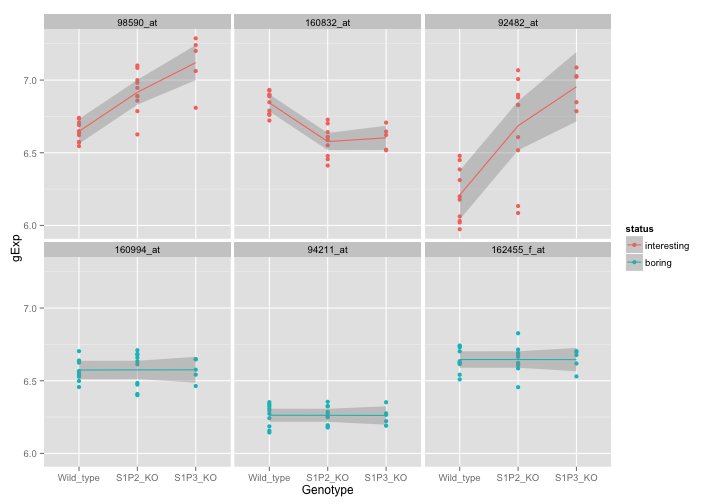 

Comment on the plots.

Among the interesting (top hits) probes, the gene expression changes with the Genotype. Among the boring probes, the gene expression shows little change between any pair of genotypes.

#### Q4e: Find probes where the expression in the S1P3 knockout is different from that of wild type.

How many hits do you find if you control FDR at 0.10?

```r
s1p3KOHits <- topTable(ncEbFit, number=Inf,
                       adjust.method="BH", p.value=0.1,
                       coef = grep("S1P3_KO", colnames(coef(ncEbFit))))
nrow(s1p3KOHits)
```

```
[1] 61
```

I find 61 hits with a difference in expression level between S1P3 knockout and wildtype.

### Q5 (5 points) Differential expression analysis for Genotype * BrainRegion.

You should be using data with the worst outlier removed, after quantile normalization and for both brain regions.


```r
desMat <- model.matrix(~Genotype*BrainRegion, nrDes)
fit <- lmFit(nrExpDat, desMat)
ebFit <- eBayes(fit)
```


#### Q5a: Fit a 3x2 full factorial model.

Test for any effect of Genotype and/or BrainRegion, i.e. test your model against a model with just an intercept. How many probes have a BH-adjusted p-value, a.k.a. q-value, less than 1e-3?


```r
hits <- topTable(ebFit, number=Inf, adjust.method="BH", p.value=1e-3,
                   coef = colnames(coef(ebFit))[-1])
nrow(hits)
```

```
[1] 1524
```

1524 probes have a BH-adjusted p-value less than 1e-3.


#### Q5b: Test the null hypothesis that BrainRegion doesn't matter, i.e. that all terms involving BrainRegion are zero.
How many probes have a BH-adjusted p-value less than 0.1?


```r
fullTableBrn <- topTable(ebFit, number=Inf, adjust.method="BH",
  coef = grep("BrainRegion", colnames(coef(ebFit))))
kBr <- nrow(subset(fullTableBrn, P.Value < 0.1))
```

4377 probes have a BH-adjusted p-value less than 0.1

#### Q5c: Highlight some probes where BrainRegion does and does not matter.


```r
# selecting interesting and  boring probes
interestProbesBrn <- rownames(head(fullTableBrn,3))
borProbesBrn <- rownames(tail(fullTableBrn,3))

intDatBrn <- multiProbeExtract(interestProbesBrn, nrExpDat, nrDes, status="interesting")

borDatBrn <- multiProbeExtract(borProbesBrn, nrExpDat, nrDes, status="boring")

selectDatBrn <- rbind(intDatBrn, borDatBrn)
```

 


```r
ggplot(selectDatBrn, 
       aes(x=Genotype, y=gExp, group=BrainRegion, color=BrainRegion)) +
  geom_point() + geom_smooth(method="loess") + 
  facet_wrap(~ probe, ncol=3)
```

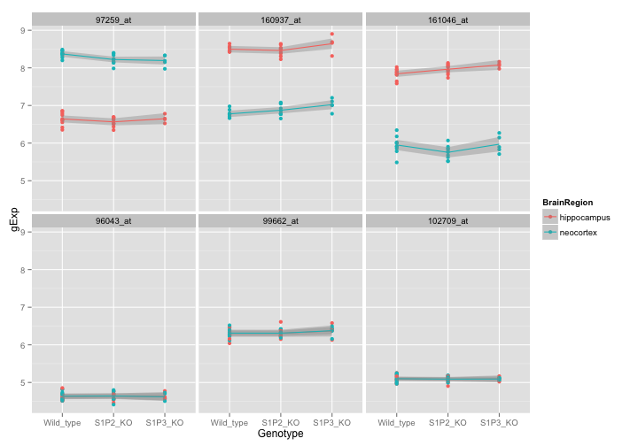 


Using the results from Q5b, plot and describe some results for a couple of hits and non-hits.

As expected, top hits probes with brainRegion effects show distinct lines for expresion level in different regions. While boring probes shows no differential expression between two brain regions.


#### Q5d: Test the null hypothesis that Genotype doesn't matter, i.e. that all terms involving Genotype are zero.


```r
hitsGn <- topTable(ebFit, number=Inf, adjust.method="BH", p.value=0.1,
  coef = grep("Genotype", colnames(coef(ebFit))))
kGn <- nrow(hitsGn)
```


How many probes have a BH-adjusted p-value less than 0.1? 141 

Compare these results to those obtained for BrainRegion in Q5b, either based on this count or based on all the p-values. What do you conclude about the relative magnitude of the influence of brain region vs. genotype on gene expression? 

I conclude that the influence of brain region has greater relative magnitude, because at the same level of FDR there are more hits with a significant BrainRegion effect than with with a Genotype effect.


