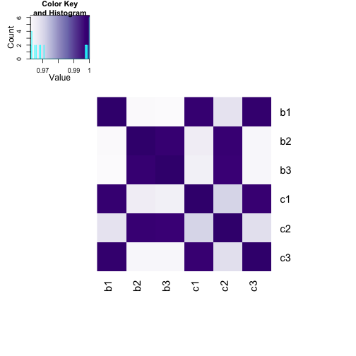
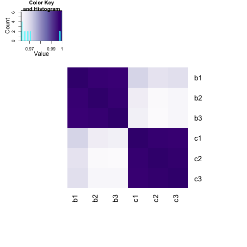
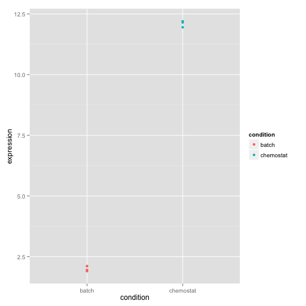
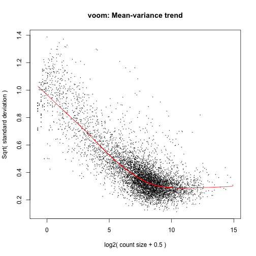

Homework 02
======================================================================


## Q1) Microarray Analysis

The six samples in this study, 3 replicates for each of the two conditions, were analysed on the Affymetrix Yeast Genome Array 2.0 platform. 

### a) (1pt) Load Microarray Data

Load the normalized data.   

```r
mcDat <- read.table("../data/yeast/GSE37599-data.tsv", 
                    header=TRUE, sep="\t", row.names=1)
```

  
What are dimensions of the dataset? In addition to reporting number of rows and columns, make it clear what rows and columns represent and how you're interpreting column names.

The dataset has 10928 rows, each of which represents a probe. It has 10928 columns, each of which represents a sample. 

First letter in the column name refers to the condition (batch vs chemostat) and the number refers to which replicate the sample belongs to.


### b) (2pt) Identify Sample Swap

The labels on two of the samples have been swapped, that is one of the batch samples has been labelled as chemostat and vice-versa. Produce the plots described below and explain how they allow you to identify the swapped samples.
  
i. (High volume) scatter plot matrix. 

```r
# png("figure/sampleSwap.scatter.png")
# splom(mcDat, panel = panel.smoothScatter)
# dev.off()
```


b1 and c2 are swapped, because the scatter plots show that b1 and c1 are each better correlated (showing less scatter) with samples of the Opposite condition than samples of its labeled condition.

ii. A heatmap of the first 100 genes (you can try more but it gets slow).


```r
# creating some color palette
jPurplesFun <- colorRampPalette(brewer.pal(n = 9, "Purples"))
jGreysFun <- colorRampPalette(brewer.pal(n = 9, "Greys"))


myheatmap <- function(sampCor, ...){
  heatmap.2(sampCor, 
            Rowv = FALSE, dendrogram="none",
            symm=TRUE, margins=c(10,10),
            trace="none", scale="none", col = jPurplesFun(256))
}

# png("figure/sampleSwapSample.heatmap.png")
# myheatmap(as.matrix(mcDat[1:100,]))
# dev.off()
```


The heatmap of expression level of 100 gene across samples shows that the expression pattern is similar for (b2, b3, c2) and (b1, c1, c3). This indicates that b1 and c2 are swapped.

iii. Compute the Pearson correlation of the samples and plot the results using a heatmap.


```r
sampleCor <- cor(mcDat)
myheatmap(sampleCor)
```

 


iv. Scatterplot the six data samples with respect to the first two principal components and label the samples.


```r
createDesign <- function(mcDat, chemoLabels){
  sampleLabels <- colnames(mcDat)
  conditions <- factor(rep("batch", length(sampleLabels)),
                       levels=c("batch", "chemostat"))
  conditions[sampleLabels %in% chemoLabels] <- "chemostat"
  mcDes <- data.frame(condition=conditions)
  rownames(mcDes) <- sampleLabels  
  return(mcDes)
} 

sampleLabels <- colnames(mcDat)
chemoSmpls <- grep("c", sampleLabels, value=TRUE)
design <- createDesign(mcDat, 
                       chemoLabels=chemoSmpls)

mcPC <- prcomp(mcDat)$rotation[,1:2]
mcPC <- cbind(design, mcPC)
p <- ggplot(mcPC, aes(x=PC1, y=PC2, color=condition, 
                       label=rownames(mcPC)))
p <- p + geom_point() 
p <- p + geom_text()
```


> Hint: If using the base graphics function `plot()`, a subsequent call to the `text()` function can be used to label each point with the corresponding sample name.

### c) (2pt) Microarray Differential Expression

Fix the label swap identified in question 1b. We want to swap b1 <--> c2. Revisit one or more elements of question 1b to sanity check before proceeding. 


```r
# correcting the labels (relying on copy-on-modify property of R)
oldSampLabels <- sampleLabels
sampleLabels[grep("b1", oldSampLabels)] <- "c2"
sampleLabels[grep("c2", oldSampLabels)] <- "b1"

print(oldSampLabels)
```

```
[1] "b1" "b2" "b3" "c1" "c2" "c3"
```

```r
print(sampleLabels)
```

```
[1] "c2" "b2" "b3" "c1" "b1" "c3"
```

```r

# relabel samples by the correct labels
colnames(mcDat) <- sampleLabels  
# sort the data samples to match with the design
mcDat <- mcDat[,rownames(design)]

sampleCor <- cor(mcDat)
myheatmap(sampleCor)
```

 


Now use this data to do a differential expression analysis with `limma`.


```r
desMat <- model.matrix(~condition, design)
mcEBFit <- eBayes(lmFit(mcDat, desMat))
mcTT <- topTable(mcEBFit, number=Inf, adjust.method="BH",
                 coef = grep("condition", colnames(desMat)))
```


Package these results in a data frame with six columns:

* probe.id - The array probe id.

* gene.id - The id of the gene which the probe overlaps (see below).

* p.value - The raw p-value for the probe.

* q.value - The BH corrected p-value, aka the q-value.

* log.fc - The log fold change which is the column called "logFC" in the limma results table.

* test.stat - The test statistics which for limma is the moderated t statistic. This is the column called "t" in the limma results table.

>  The gene id can be retrieved using the `yeast2.db` package from Bioconductor. In particular, the `yeast2ORF` object available after loading `yeast2.db` contains the mapping between probe IDs and yeast gene ids. Assuming you have a character vector of probes called `probe.ids`, the gene IDs can be retrieved using `gene.ids <- unlist(mget(probe.ids, yeast2ORF))`.


```r
# gene names sorted by toptable result above
genes <- unlist(mget(rownames(mcTT), yeast2ORF))
expect_equal(names(genes), rownames(mcTT))

mcTT <- mcTT[, c("P.Value", "adj.P.Val", "logFC", "t")]
colnames(mcTT) <- c("p.value", "q.value", "log.fc", "test.stat")
mcTT <- cbind(probe.id=rownames(mcTT), gene.id=genes, mcTT)
```


Remove any rows with probes which don't map to genes. You'll be able to find these because they will have `NA` as their gene id. Work with this data.frame to answer the questions below.


```r
mcTT <- mcTT[!is.na(mcTT$gene.id),]
```


i. How many probes did we start with and how many remain after removing probes without gene ids?

We started with 10928 probes. And 5705 remain after removing probes without gene ids.


ii. Illustrate the differential expression between the batch and the chemostat samples for the top hit (i.e., probe with the lowest p- or q-value).


```r
expect_equal(rownames(design), colnames(mcDat))

prepareData <- function(probeId){
  probeDat <- mcDat[rownames(mcDat)==probeId,]
  
  newDat <- cbind(design, t(probeDat))
  
  # in case of multiple probes selected
  newDat <- melt(newDat, "condition", variable_name="probe.id")
  newDat <- rename(newDat, c("value"="expression"))  # rename column
  return(newDat)
}

topHitPid <- mcTT[1,"probe.id"]
topHitDat <- prepareData(topHitPid)

p <- ggplot(topHitDat, aes(x=condition, y=expression, color=condition)) 
p <- p + geom_point()
p
```

 


iii. How many probes are identified as differentially expressed at a false discovery rate (FDR) of 1e-5 (note: this is a FDR cutoff used in the original paper)?


```r
fdr <- 1e-5
nHits <- sum(mcTT$q.value <= fdr)
```


725 probes are identified as differentially expressed at FDR of 10<sup>-5</sup>.

iv. Save your results for later with `write.table()`.

> When using write.table to save the data, you need to pass the arguments `row.names = TRUE, col.names = NA` to make sure the headers are written correctly.


```r
write.table(mcTT, "results/condition.topTable.GSE37599.tsv",
            row.names = TRUE, col.names = NA, sep="\t")
```


## Q2) RNA-Seq Analysis

> We have aligned the RNA-Seq library using the [Stampy](http://www.well.ox.ac.uk/project-stampy) aligner and generated count data. The data file is available as [stampy.counts.tsv](../../examples/yeastPlatforms/data/stampy.counts.tsv). In this question you will use this data to do a differential expression analysis using different packages from Bioconductor.


### a) (1pt) Load RNA Count Data and Sanity Check


```r
rcDat <- read.table("../data/yeast/stampy.counts.tsv", 
                    header=TRUE, row.names=1)
rcDat <- rcDat[, rownames(design)]  # make sure that sample (column) order matches the design
```


i) What are dimensions of the dataset? In addition to reporting number of rows and columns, make it clear what rows and columns represent. What is the difference between the rows of this dataset versus rows of the array data in question 1a?

The dataset has 6542 rows, each representing a gene (I guess Stampy aligns to the genome?), and 6 columns, each representing a sample. Here we have genes for the rows instead of probes with the microarray data, because, first, RNA-seq doesn't use probes, and, second, with that aligner RNA transcripts are mapped to genes.


ii) Do a sanity check to make sure there is no sample swap by plotting a heatmap of the sample correlations.


```r
sampleCor <- cor(rcDat)
myheatmap(sampleCor)
```

 


Since samples are strongly correlated within same condition, and less correlated between different conditions, no smaple seems to have occured.

### b) (2pt) `edgeR` Differential Expression Analysis

Now you will use `edgeR` to identify differentially expressed genes between the batch medium vs. chemostat conditions.

i)  Recall that `edgeR` needs to estimate the dispersion parameter in the negative binomial model using an empirical Bayes method. Estimate the dispersion parameters using `estimateGLMCommonDisp`, `estimateGLMTrendedDisp` and `estimateGLMTagwiseDisp`. Plot the tagwise dispersion against log2-CPM (counts per million).  


```r
dge.glm <- DGEList(counts=rcDat, group=design$condition)
desMat <- model.matrix(~condition, design)
dge.glm.com.disp <- estimateGLMCommonDisp(dge.glm, desMat, verbose=TRUE)
```

```
Disp = 0.00551 , BCV = 0.0742 
```

```r
dge.glm.trend.disp <- estimateGLMTrendedDisp(dge.glm.com.disp, desMat)
```

```
Loading required package: splines
```

```r
dge.glm.tag.disp <- estimateGLMTagwiseDisp(dge.glm.trend.disp, desMat)
#plot the tagwise dispersion against log2-CPM (counts per million)
plotBCV(dge.glm.tag.disp)
```

 


ii)  Use the glm functionality of `edgeR`, i.e. use the `glmFit` function, to identify differentially expressed genes between conditions. 


```r
edger.fit <- glmFit(dge.glm.tag.disp, desMat)
edger.lrt <- glmLRT(edger.fit, coef=grep("condition", colnames(desMat)))
edger.results <- topTags(edger.lrt, n=Inf, adjust.method="BH", sort.by="PValue")
```


Package these results in a data.frame called 'edger.results' with five columns:

* gene.id - The id of the gene which reads were aligned to.

* p.value - The raw p-value for the gene.

* q.value - The BH corrected p-value, aka the q-value.

* log.fc - The log fold change which is the column called "logFC" in the `edgeR` results table.

* test.stat - The test statistic, which for `edgeR` is a likelihood ratio. This is the column called "LR" in the `edgeR` results table.


```r
edger.results <- data.frame(edger.results[,c("PValue", "FDR", "logFC", "LR")])
colnames(edger.results) <- c("p.value", "q.value", "log.fc", "test.stat")
edger.results <- cbind(gene.id=rownames(edger.results), edger.results)
```


Save your results for later with `write.table()` in file called `stampy.edger.results.tsv`.


```r
write.table(edger.results, "results/stampy.edger.results.tsv",
            row.names=TRUE, col.names = NA, sep="\t")
```


iii) How many genes are differentially expressed between conditions at a false discovery rate (FDR) of 1e-5?


```r
fdr <- 1e-5
edger.nHits <- sum(edger.results$q.value <= 1e-5)
```


2669 genes are differentially expressed between conditions at FDR of 10<sup>-5</sup>.

iv) How many genes are differentially over-expressed in chemostat compared to batch medium samples at a false discovery rate (FDR) of 1e-5?


```r
edger.OX.nHits <- sum(
  edger.results$q.value <= 1e-5 & 
  edger.results$log.fc > 0)
```


1515 are differentially over-expressed in chemostat compared to batch with 10<sup>-5</sup>.

### c) (2pt) `DESeq` Differential Expression Analysis

Now you will use `DESeq` to identify differentially expressed genes between the batch medium vs. chemostat conditions.

i)  `DESeq` also needs to estimate the dispersion. Use `estimateSizeFactors` and `estimateDispersions` to normalize the data. Plot the estimated dispersions against the mean normalized counts.


```r

#reading in the same count table data and grouping information
deSeqDat <- newCountDataSet(rcDat, conditions=design$condition)
#head(counts(deDat))

# account for differences in library coverage and
deSeqDat <- estimateSizeFactors(deSeqDat)  
#sizeFactors(deSeqDat)
deSeqDat <- estimateDispersions(deSeqDat)   # estimate variance

#plotting the estimated dispersions against the mean normalized counts
plotDispEsts(deSeqDat)
```

 


ii)  Use the negative binomial test of `DESeq`, i.e. use the `nbinomTest` function, to identify differentially expressed genes between conditions. Note that the output of this function does not return results ordered by p-values or logged fold-changes. You can manually reorder the results if you want (not required for this homework).


```r
## this takes a minute or so for JB
deseq.results <- nbinomTest(deSeqDat, 
                      levels(design$condition)[1], 
                      levels(design$condition)[2])
plotMA(deseq.results)
```

 


Package these results in a data.frame called 'deseq.results' with four columns:

* gene.id - The id of the gene which reads were aligned to.

* p.value - The raw p-value for the gene.

* q.value - The BH corrected p-value, aka the q-value.

* log.fc - The log fold change which is the column called "log2FoldChange" in the `deseq` results table.

Save your results for later with `write.table()` in file called `stampy.deseq.results.tsv`.


```r
deseq.results <- deseq.results[,c("id", "pval", "padj", "log2FoldChange")]
colnames(deseq.results) <- c("gene.id", "p.value", "q.value", "log.fc")
write.table(deseq.results, "results/stampy.deseq.results.tsv",
            row.names=TRUE, col.names = NA, sep="\t")
```


iii) How many genes are differentially expressed between conditions at a false discovery rate (FDR) of 1e-5?


```r
deseq.nHits <- sum(deseq.results$q.value <= fdr)
```


2198 genes are differentially expressed between conditions at a false discovery rate (FDR) of 10<sup>-5</sup>.

iv) How many differentially expressed genes are identified by both 'edgeR' and 'DESeq'?


```r
getHitsGeneId <- function(results, fdr=1e-5){
  isDiff <- (results$q.value <= fdr)
  return(results$gene.id[isDiff])
}

bothHitGenes <- intersect(getHitsGeneId(edger.results),
                          getHitsGeneId(deseq.results))
```


2176 differentially expressed genes are identified by both 'edgeR' and 'DESeq'.


### d) (2pt) `voom` Differential Expression Analysis

Now you will use `voom+limma` to identify differentially expressed genes between the batch medium vs. chemostat conditions.

i)  `voom` normalizes the counts before it converts counts to log2-cpm. Use `calcNormFactors` to normalize counts.


```r
norm.factor <- calcNormFactors(rcDat)
lib.size <- colSums(rcDat)*norm.factor
```


ii)  Use `voom' to convert count data into logged CPM data and then use 'limma' to identify differentially expressed genes between conditions. 


```r
dat.voomed <- voom(rcDat, desMat, plot=TRUE,lib.size=lib.size)
```

 

```r

voom.fit <- eBayes(lmFit(dat.voomed, desMat))
voom.results <- topTable(voom.fit, number=Inf, adjust.method="BH",
                   coef = grep("condition", colnames(desMat)))
```


Package these results in a data.frame called 'voom.limma.results' with five columns:

* gene.id - The id of the gene which reads were aligned to.

* p.value - The raw p-value for the gene.

* q.value - The BH corrected p-value, aka the q-value.

* log.fc - The log fold change which is the column called "logFC" in the `edgeR` results table.

* test.stat - The test statistic, which is the column called "t".

Save your results for later with `write.table()` in file called `stampy.limma.results.tsv`.


```r
voom.results <- voom.results[, c("P.Value", "adj.P.Val", "logFC", "t")]
colnames(voom.results) <- c("p.value", "q.value", "log.fc", "test.stat")
voom.results <- cbind(gene.id=rownames(voom.results), voom.results)
```


iii) How many genes are differentially expressed between conditions at a false discovery rate (FDR) of 1e-5?


```r
voomHitGenes <- getHitsGeneId(voom.results)
```


```

Error in base::parse(text = code, srcfile = NULL) : 
  2:0: unexpected end of input
1: length(voomHitGenes
   ^

```

 genes are differentially expressed between conditions at a false discovery rate (FDR) of 10<sup>-5</sup>.

iv)  What fraction of the genes identified using `voom+limma` are also found by `edger` and `DESeq` methods? For example if the DE analysis using `voom+limma` found 1000 genes and both `edgeR` and `DESeq`  found 500 of these, the fraction of genes found would be $\frac{500}{1000}=0.5$.


```r
allHitGenes <- intersect(voomHitGenes, bothHitGenes)
r <- length(allHitGenes) / length(voomHitGenes)
```


99.8885% of the genes identified using `voom+limma` are also found by `edger` and `DESeq` methods.

### e) (3pt) Comparison of Differential Expression Analyses
 
Now that we have the results of the differential expression analysis performed by three popular methods, we are going to compare and illustrate the results.

i) In previous questions, we noticed that different methods identified different differentially expressed genes. Create a Venn diagram showing all genes identified as differentially expressed by `edgeR`, `DESeq`, and `voom+limma`. Check your if your answers to questions 2c-iv, and 2d-iv are correct.

> The Venn diagram can be drawn using the `VennDiagram` package. It's a little obtuse if you want to plot to screen (or embed image using knitr), but the following code should get you started. Also be aware there is an argument called `force.unique`, which defaults to TRUE, that determines how elements that appear more than once in a set are handled when forming the Venn counts (in particular useful in question 3). 


```r
library(VennDiagram)
```

```
## Loading required package: grid
```

```r

# Fake some gene names for 4 different methods.  Note that in this example,
# I'm comparing 4 different sets so that you can see how to handle more
# complex cases.

method1.de.genes <- c("A", "B", "C")

method2.de.genes <- c("A", "B", "D", "E", "F")

method3.de.genes <- c("A", "B", "D", "E")

method4.de.genes <- c("A", "V", "E", "F")

# Put the things you want to plot in a list. The names in the list will be
# put on the plot.
de.genes <- list(Method1 = method1.de.genes, Method2 = method2.de.genes, Method3 = method3.de.genes, 
    Method4 = method4.de.genes)

# Start a new plot
plot.new()

# Draw the Venn diagram. Note the argument `filename=NULL` tells it to
# create a plot object instead of outputting to file.
venn.plot <- venn.diagram(de.genes, filename = NULL, fill = c("red", "blue", 
    "green", "yellow"))

# Draw the plot on the screen.
grid.draw(venn.plot)
```


ii) Using the function `plotSmear` function from `edgeR`, you can look at a scatterplot of observed differential expression (y-axis) against overall abundance (x-axis), both axes logarithmically transformed -- to check that putative DE genes seem plausible. Create a smear plot. Within this plot, identify the set of genes which are differentially expressed at an FDR of 1e-5 using all three methods (i.e., the q-values estimated by `edgeR`, `DESeq`, and `voom` are below 1e-5). Explain how you interpret this plot. Do you see reasonable results?

> Use the output of `DGEList` as the object of `plotSmear`. Use de.tags to highlight genes selected by all methods.


iii) There are two genes identified by `edgeR` and `voom+limma` but not by `DESeq`. Illustrate the logged counts of them. Compare the (log) counts of these two genes with those of two genes identified by the three methods (see example below)

> As an example, I illustrate two gene that were identified by all three methods. The function `setdiff` is helpful to find differences between two sets.


```r
library(lattice)
featureMe <- c("YDR384C", "YDR345C")
(featureCounts <- counts[featureMe, ])
```

```
##           b1   b2   b3   c1   c2   c3
## YDR384C  176  243  182 3332 3778 4531
## YDR345C 6155 8629 6357  322  345  462
```

```r
featureDat <- data.frame(gene.id = factor(rep(rownames(featureCounts), ncol(featureCounts))), 
    cond = factor(rep(groups, each = nrow(featureCounts))), log.count = log2(unlist(featureCounts)))
stripplot(gene.id ~ log.count, featureDat, groups = cond, auto.key = TRUE, jitter = TRUE)
```

 

```r

# Using the example created before to illustrate the `setdiff` function
setdiff(method1.de.genes, method2.de.genes)  #'C' is present in Method1 but not in Method2
```

```
## [1] "C"
```


## Q3) Compare DEA results between RNA-Seq and array

In question 1, you performed a DEA of array data using `limma`. In question 2, you used different methods to perform DEA of RNA-Seq data. In particular, in this question, you will focus on the DEA using `edgeR` (question 2b) to compare the results of RNA-Seq DEA with those of the array DEA . 

> Remember that you've packaged your results and saved them using `write.table()`. If the data.frames containing the results of these analyses are no longer in your workspace, load them using `read.table()`.

i) Use a Venn diagram to display the overlap and non-overlap of the __genes__ identified as differentially expressed at an FDR of 1e-5 by these analyses (i.e., array vs `edgeR` differentially expressed genes).

> Note that the number of __probes__ that you identified as differentially expressed at an FDR of 1e-5 in question 1c(iii) may be different from the number of __genes__ identified as differentially expressed at the same FDR! Why? The use of the argument `force.unique` of `venn.diagram()` is crucial here.


ii) As expected, more genes were identified as differentially expressed using RNA-Seq data. In this question, you will examine the difference between the q-values from both analyses (i.e., array and `edgeR`) by overlaying density plots of the q-values from each analysis.

  * To respond to this question, make two plots. One plot that includes the densities of q-values of the genes analyzed by both platforms (i.e., genes shared by both data frames), and another plot that includes the densities of q-values of ALL genes analyzed by at least one of the platforms.
  
Make some observations about the strengths of these two platforms.
  


iii) We provide a data set with array expression and count data for 5 interesting genes; below is also code to load it and a figure depicting it. Consult the array and the `edgeR` DEA results from your previous analyses for these genes. For each gene, state its status with respect to these analyses, i.e. where it falls in those Venn diagrams. Comment on the results and plots.

The data set is on GitHub and in the course webpage:

  * <https://raw.github.com/jennybc/stat540_2014/master/examples/yeastPlatforms/data/featGenesData-q3-DPUT.txt>
  * <http://www.ugrad.stat.ubc.ca/~stat540/examples/yeastPlatforms/data/featGenesData-q3-DPUT.txt>
  
Load it with a line like this:  
```
jDat <- dget("featGenesData-q3-DPUT.txt")
```


