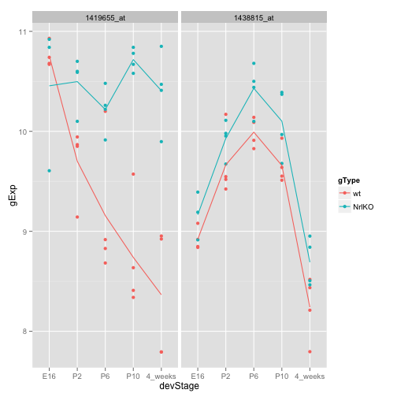
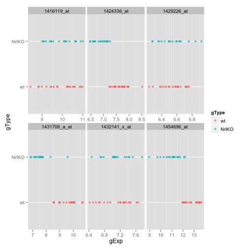
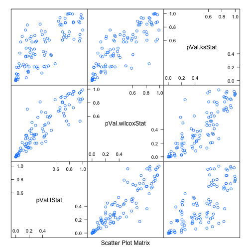
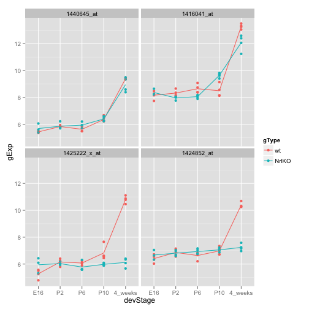

Two group comparisons and data aggregation
======================================================================


```r
library(lattice)
library(ggplot2)
library(plyr)
library(reshape)
```

```
## 
## Attaching package: 'reshape'
## 
## The following objects are masked from 'package:plyr':
## 
##     rename, round_any
```

```r
prDat <- read.table("../data/photoRec/GSE4051_data.tsv")
str(prDat, max.level = 0)
```

```
## 'data.frame':	29949 obs. of  39 variables:
```

```r
prDes <- readRDS("../data/photoRec/GSE4051_design.rds")
str(prDes)
```

```
## 'data.frame':	39 obs. of  4 variables:
##  $ sidChar : chr  "Sample_20" "Sample_21" "Sample_22" "Sample_23" ...
##  $ sidNum  : num  20 21 22 23 16 17 6 24 25 26 ...
##  $ devStage: Factor w/ 5 levels "E16","P2","P6",..: 1 1 1 1 1 1 1 2 2 2 ...
##  $ gType   : Factor w/ 2 levels "wt","NrlKO": 1 1 1 1 2 2 2 1 1 1 ...
```


## Two sample tests -- one gene

Let's extract the data for one gene and put in a data.frame with the experimental information.

```r
set.seed(987)
(theGene <- sample(1:nrow(prDat), 1))
```

```
## [1] 14294
```

```r
pDat <- data.frame(prDes, gExp = unlist(prDat[theGene, ]))
str(pDat)
```

```
## 'data.frame':	39 obs. of  5 variables:
##  $ sidChar : chr  "Sample_20" "Sample_21" "Sample_22" "Sample_23" ...
##  $ sidNum  : num  20 21 22 23 16 17 6 24 25 26 ...
##  $ devStage: Factor w/ 5 levels "E16","P2","P6",..: 1 1 1 1 1 1 1 2 2 2 ...
##  $ gType   : Factor w/ 2 levels "wt","NrlKO": 1 1 1 1 2 2 2 1 1 1 ...
##  $ gExp    : num  9.88 10.59 10.28 10.22 8.75 ...
```


Always explore the data before plunging into analysis! What are the sample means in the wild type and Nrl knockout groups (yes, we're ignoring developmental stage today)? (`aggregate()` and other data aggregation functions are explained below.)


```r
aggregate(gExp ~ gType, pDat, FUN = mean)
```

```
##   gType  gExp
## 1    wt 9.758
## 2 NrlKO 9.553
```


Doing the same with a `plyr` function:


```r
ddply(pDat, ~ gType, summarize, gExp = mean(gExp))
```

```
##   gType  gExp
## 1    wt 9.758
## 2 NrlKO 9.553
```


Let's make a stripplot so we can sanity test our $t$ test result.
And again with `ggplot2`:


```r
ggplot(pDat, aes(x = gExp, y = gType)) + geom_point()
```

 


We will do a two-sample $t$ test comparing wild type to the Nrl knockouts.


```r
t.test(gExp ~ gType, pDat)
```

```
## 
## 	Welch Two Sample t-test
## 
## data:  gExp by gType
## t = 1.479, df = 36.78, p-value = 0.1475
## alternative hypothesis: true difference in means is not equal to 0
## 95 percent confidence interval:
##  -0.07586  0.48605
## sample estimates:
##    mean in group wt mean in group NrlKO 
##               9.758               9.553
```


If we save the $t$ test result, we can inspect what it is.


```r
ttRes <- t.test(gExp ~ gType, pDat)
str(ttRes)
```

```
## List of 9
##  $ statistic  : Named num 1.48
##   ..- attr(*, "names")= chr "t"
##  $ parameter  : Named num 36.8
##   ..- attr(*, "names")= chr "df"
##  $ p.value    : num 0.148
##  $ conf.int   : atomic [1:2] -0.0759 0.4861
##   ..- attr(*, "conf.level")= num 0.95
##  $ estimate   : Named num [1:2] 9.76 9.55
##   ..- attr(*, "names")= chr [1:2] "mean in group wt" "mean in group NrlKO"
##  $ null.value : Named num 0
##   ..- attr(*, "names")= chr "difference in means"
##  $ alternative: chr "two.sided"
##  $ method     : chr "Welch Two Sample t-test"
##  $ data.name  : chr "gExp by gType"
##  - attr(*, "class")= chr "htest"
```

It is a `list`; some of the more interesting and useful components are the test statistic and p-value. Recall how to extract components of a list:

```r
ttRes$statistic
```

```
##     t 
## 1.479
```

```r
ttRes$p.value
```

```
## [1] 0.1475
```


## Two sample tests -- a handful of genes

Let's grab the data from 6 genes. I've picked them for you: 3 are interesting ('hits'), 3 are not. 

```r
keepGenes <- c("1431708_a_at", "1424336_at", "1454696_at",
               "1416119_at", "1432141_x_at", "1429226_at" )
miniDat <- subset(prDat, rownames(prDat) %in% keepGenes)
```


```r
prepareData <- function(jDat, design){
  jDat <- jDat[design$sidChar]
  newDat <- cbind(design, t(jDat))
  
  # in case of multiple probes selected
  newDat <- melt(newDat, 
                 measure.vars=grep("_at", colnames(newDat), value=TRUE))
  newDat <- rename(newDat, c("value"="gExp",
                             "variable"="gene"))  # rename column
  return(newDat)
}

miniDat <- prepareData(miniDat, prDes)
str(miniDat)
```

```
## 'data.frame':	234 obs. of  6 variables:
##  $ sidChar : chr  "Sample_20" "Sample_21" "Sample_22" "Sample_23" ...
##  $ sidNum  : num  20 21 22 23 16 17 6 24 25 26 ...
##  $ devStage: Factor w/ 5 levels "E16","P2","P6",..: 1 1 1 1 1 1 1 2 2 2 ...
##  $ gType   : Factor w/ 2 levels "wt","NrlKO": 1 1 1 1 2 2 2 1 1 1 ...
##  $ gene    : Factor w/ 6 levels "1416119_at","1424336_at",..: 1 1 1 1 1 1 1 1 1 1 ...
##  $ gExp    : num  10.6 11 10.8 10.9 9.2 ...
```


Plot the genes:

```r
ggplot(miniDat, aes(x = gExp, y = gType, color = gType)) +
  facet_wrap(~ gene, scales="free_x") +
  geom_point(alpha = 0.7) +
  theme(panel.grid.major.x = element_blank())
```

 


Let's use data aggregation techniques to conduct some two group comparisons for each of these 6 genes. Recall the syntax of the two-sample t-test for one gene:


```r
t.test(gExp ~ gType, someDat)
```


```r
d_ply(miniDat, ~ gene, function(x) t.test(gExp ~ gType, x), .print = TRUE)
```

```
## 
## 	Welch Two Sample t-test
## 
## data:  gExp by gType
## t = -0.184, df = 36.53, p-value = 0.8551
## alternative hypothesis: true difference in means is not equal to 0
## 95 percent confidence interval:
##  -0.5079  0.4234
## sample estimates:
##    mean in group wt mean in group NrlKO 
##               9.893               9.935 
## 
## 
## 	Welch Two Sample t-test
## 
## data:  gExp by gType
## t = 9.061, df = 36.49, p-value = 7.146e-11
## alternative hypothesis: true difference in means is not equal to 0
## 95 percent confidence interval:
##  0.6239 0.9835
## sample estimates:
##    mean in group wt mean in group NrlKO 
##               7.670               6.867 
## 
## 
## 	Welch Two Sample t-test
## 
## data:  gExp by gType
## t = 0.0983, df = 35.58, p-value = 0.9223
## alternative hypothesis: true difference in means is not equal to 0
## 95 percent confidence interval:
##  -0.1019  0.1123
## sample estimates:
##    mean in group wt mean in group NrlKO 
##               6.551               6.546 
## 
## 
## 	Welch Two Sample t-test
## 
## data:  gExp by gType
## t = 9.838, df = 36.89, p-value = 7.381e-12
## alternative hypothesis: true difference in means is not equal to 0
## 95 percent confidence interval:
##  1.570 2.384
## sample estimates:
##    mean in group wt mean in group NrlKO 
##               9.554               7.578 
## 
## 
## 	Welch Two Sample t-test
## 
## data:  gExp by gType
## t = -0.1324, df = 36.31, p-value = 0.8954
## alternative hypothesis: true difference in means is not equal to 0
## 95 percent confidence interval:
##  -0.2413  0.2118
## sample estimates:
##    mean in group wt mean in group NrlKO 
##               7.092               7.107 
## 
## 
## 	Welch Two Sample t-test
## 
## data:  gExp by gType
## t = 8.077, df = 33.49, p-value = 2.278e-09
## alternative hypothesis: true difference in means is not equal to 0
## 95 percent confidence interval:
##  1.402 2.346
## sample estimates:
##    mean in group wt mean in group NrlKO 
##               12.85               10.97
```

```r
d_ply(miniDat, ~ gene, function(x) wilcox.test(gExp ~ gType, x, exact=FALSE), .print = TRUE)
```

```
## 
## 	Wilcoxon rank sum test with continuity correction
## 
## data:  gExp by gType
## W = 188, p-value = 0.9664
## alternative hypothesis: true location shift is not equal to 0
## 
## 
## 	Wilcoxon rank sum test with continuity correction
## 
## data:  gExp by gType
## W = 379, p-value = 1.179e-07
## alternative hypothesis: true location shift is not equal to 0
## 
## 
## 	Wilcoxon rank sum test with continuity correction
## 
## data:  gExp by gType
## W = 202, p-value = 0.7465
## alternative hypothesis: true location shift is not equal to 0
## 
## 
## 	Wilcoxon rank sum test with continuity correction
## 
## data:  gExp by gType
## W = 371, p-value = 3.945e-07
## alternative hypothesis: true location shift is not equal to 0
## 
## 
## 	Wilcoxon rank sum test with continuity correction
## 
## data:  gExp by gType
## W = 193, p-value = 0.944
## alternative hypothesis: true location shift is not equal to 0
## 
## 
## 	Wilcoxon rank sum test with continuity correction
## 
## data:  gExp by gType
## W = 372, p-value = 3.397e-07
## alternative hypothesis: true location shift is not equal to 0
```


```r
d_ply(miniDat, ~ gene, function(x){
  ks.test(with(x, gExp[gType=="wt"]),
          with(x, gExp[gType=="NrlKO"]), exact=FALSE)
  }, .print = TRUE)
```

```
## 
## 	Two-sample Kolmogorov-Smirnov test
## 
## data:  with(x, gExp[gType == "wt"]) and with(x, gExp[gType == "NrlKO"])
## D = 0.2, p-value = 0.8306
## alternative hypothesis: two-sided
```

```
## Warning: p-value will be approximate in the presence of ties
```

```
## 
## 	Two-sample Kolmogorov-Smirnov test
## 
## data:  with(x, gExp[gType == "wt"]) and with(x, gExp[gType == "NrlKO"])
## D = 0.95, p-value = 4.603e-08
## alternative hypothesis: two-sided
```

```
## Warning: p-value will be approximate in the presence of ties
```

```
## 
## 	Two-sample Kolmogorov-Smirnov test
## 
## data:  with(x, gExp[gType == "wt"]) and with(x, gExp[gType == "NrlKO"])
## D = 0.1342, p-value = 0.9947
## alternative hypothesis: two-sided
## 
## 
## 	Two-sample Kolmogorov-Smirnov test
## 
## data:  with(x, gExp[gType == "wt"]) and with(x, gExp[gType == "NrlKO"])
## D = 0.9474, p-value = 5.073e-08
## alternative hypothesis: two-sided
```

```
## Warning: p-value will be approximate in the presence of ties
```

```
## 
## 	Two-sample Kolmogorov-Smirnov test
## 
## data:  with(x, gExp[gType == "wt"]) and with(x, gExp[gType == "NrlKO"])
## D = 0.2842, p-value = 0.4107
## alternative hypothesis: two-sided
```

```
## Warning: p-value will be approximate in the presence of ties
```

```
## 
## 	Two-sample Kolmogorov-Smirnov test
## 
## data:  with(x, gExp[gType == "wt"]) and with(x, gExp[gType == "NrlKO"])
## D = 0.8947, p-value = 3.356e-07
## alternative hypothesis: two-sided
```


Use `dlply()` to retain everything in a new list with one component per probeset:

```r
ttRes <- dlply(miniDat, ~ gene, function(x) t.test(gExp ~ gType, x))
names(ttRes)
```

```
## [1] "1416119_at"   "1424336_at"   "1429226_at"   "1431708_a_at"
## [5] "1432141_x_at" "1454696_at"
```

```r
ttRes[["1454696_at"]]
```

```
## 
## 	Welch Two Sample t-test
## 
## data:  gExp by gType
## t = 8.077, df = 33.49, p-value = 2.278e-09
## alternative hypothesis: true difference in means is not equal to 0
## 95 percent confidence interval:
##  1.402 2.346
## sample estimates:
##    mean in group wt mean in group NrlKO 
##               12.85               10.97
```


## Ideas for take-home work

In our last example, can you edit the inner function to use the Wilcoxon or KS test? Or maybe do the $t$ test, the Wilcoxon, and the KS test and return all 3 p-values?

Conduct two group comparisons for all 6 genes, and store test statistics and the p-values via `ddply()`

```r
multiCompare <- function(jDat){
  ttRes <- ddply(jDat, ~ gene, function(z) {
    tz <- t.test(gExp ~ gType, z)
    wz <- wilcox.test(gExp ~ gType, z, exact=FALSE)
    kz <- suppressWarnings(
      ks.test(with(z, gExp[gType=="wt"]),
              with(z, gExp[gType=="NrlKO"]), exact=FALSE))
    
    c(tStat = tz$statistic, pVal.tStat = tz$p.value,
      wilcoxStat=wz$statistic, pVal.wilcoxStat = wz$p.value,
      ksStat=kz$statistic, pVal.ksStat = kz$p.value)
    })
  return(ttRes)
}
multiCompare(miniDat)
```

```
##           gene  tStat.t pVal.tStat wilcoxStat.W pVal.wilcoxStat ksStat.D
## 1   1416119_at -0.18395  8.551e-01          188       9.664e-01   0.2000
## 2   1424336_at  9.06067  7.146e-11          379       1.179e-07   0.9500
## 3   1429226_at  0.09827  9.223e-01          202       7.465e-01   0.1342
## 4 1431708_a_at  9.83798  7.381e-12          371       3.945e-07   0.9474
## 5 1432141_x_at -0.13241  8.954e-01          193       9.440e-01   0.2842
## 6   1454696_at  8.07708  2.278e-09          372       3.397e-07   0.8947
##   pVal.ksStat
## 1   8.306e-01
## 2   4.603e-08
## 3   9.947e-01
## 4   5.073e-08
## 5   4.107e-01
## 6   3.356e-07
```


Scale up to more genes ... I'm thinking ~100. 


```r
set.seed(987)
keep <- sample(1:nrow(prDat), size=100)
head(keep)
```

```
## [1] 14294 29667 18161 17268 24228  6957
```

```r
miniDat2 <- prepareData(prDat[keep,], prDes)
```


Make a numeric matrix with p-values for many genes (= rows) for various two-group tests. Scatterplot them against each other. Are the p-values as similar as you'd expect? Do you need to log transform the axes to get more insight?


```r
tr2 <- multiCompare(miniDat2)
pvals2 <- tr2[,grep("pVal", colnames(tr2))]
splom(pvals2)
```

 

```r
cor(pvals2)
```

```
##                 pVal.tStat pVal.wilcoxStat pVal.ksStat
## pVal.tStat          1.0000          0.9059      0.7641
## pVal.wilcoxStat     0.9059          1.0000      0.8398
## pVal.ksStat         0.7641          0.8398      1.0000
```

The p-values don't seem very correlated between different tests.

Try log2 transform the p-values, because I don't care much whether those large p-values are correlated, instead I'm interested in whether small p-values that indicates significance is consistent between different tests. Log2 transform reduces the effect of large p-values.

```r
splom(log2(pvals2), panel=panel.smoothScatter)
```

```
## KernSmooth 2.23 loaded
## Copyright M. P. Wand 1997-2009
## (loaded the KernSmooth namespace)
```

 

```r
cor(log2(pvals2))
```

```
##                 pVal.tStat pVal.wilcoxStat pVal.ksStat
## pVal.tStat          1.0000          0.9723      0.9466
## pVal.wilcoxStat     0.9723          1.0000      0.9574
## pVal.ksStat         0.9466          0.9574      1.0000
```


Convert your numeric matrix of p-values into a matrix of `TRUE/FALSE` or zeros and ones by hard-threshholding, e.g. at the conventional 0.05 level. Use `apply()` or a function from `plyr` to make some interesting row or column summaries. How many genes are significant according to the different tests? For each gene, how many of the tests return a significant p-value? How many genes are "hits" by all 3 methods, by exactly 2, by exactly 1 and by none?


```r
sigCount <- apply(pvals2 <= 0.05, 1, sum)
sum(sigCount == 3)
```

```
## [1] 9
```

```r
sum(sigCount == 2)
```

```
## [1] 5
```

```r
sum(sigCount == 1)
```

```
## [1] 2
```


Use `system.time()` to do a little timing study, doing differential expression analysis for gene sets of various sizes. I'm thinking 5, 10, 50, 100, 500 ... somthing like that. Don't immediately go all the way to 30K. We will use different strategies for our full scale-up. Plot the DE analysis time against the number of genes.


```r
for (n in c(5, 10, 50, 100, 500)){
  set.seed(987)
  keep <- sample(1:nrow(prDat), size=n)
  head(keep)
  miniDat2 <- prepareData(prDat[keep,], prDes)
  print(system.time(multiCompare(miniDat2)))
}
```

```
##    user  system elapsed 
##   0.023   0.000   0.023 
##    user  system elapsed 
##   0.036   0.000   0.036 
##    user  system elapsed 
##   0.176   0.001   0.176 
##    user  system elapsed 
##   0.359   0.002   0.361 
##    user  system elapsed 
##   1.882   0.007   1.901
```


