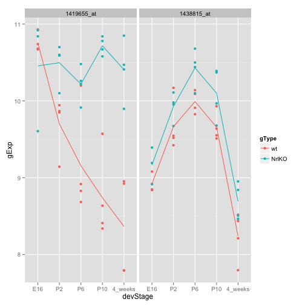
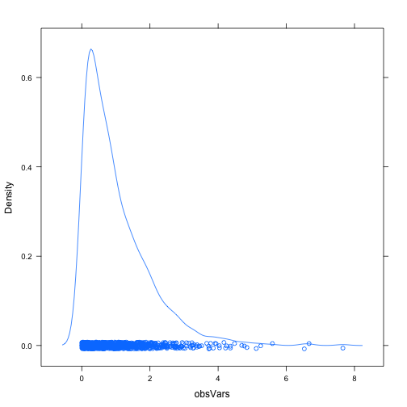
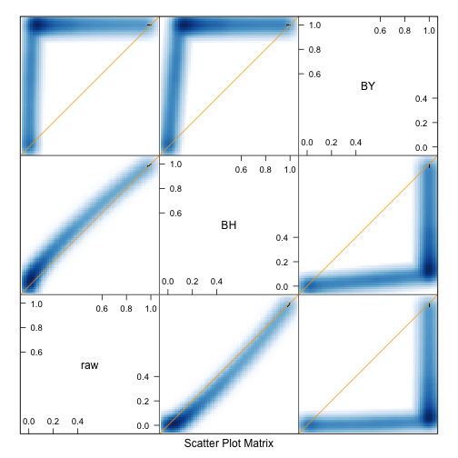

Fitting and interpreting linear models (low volume)
======================================================================


```r
library(ggplot2) 
library(lattice)
library(reshape) # for the function melt
```

```
## Loading required package: plyr
## 
## Attaching package: 'reshape'
## 
## The following objects are masked from 'package:plyr':
## 
##     rename, round_any
```

```r
library(plyr)
prDat <- read.table("../data/photoRec/GSE4051_data.tsv")
str(prDat, max.level = 0)
```

```
## 'data.frame':	29949 obs. of  39 variables:
```

```r
prDes <- readRDS("../data/photoRec/GSE4051_design.rds")
str(prDes)
```

```
## 'data.frame':	39 obs. of  4 variables:
##  $ sidChar : chr  "Sample_20" "Sample_21" "Sample_22" "Sample_23" ...
##  $ sidNum  : num  20 21 22 23 16 17 6 24 25 26 ...
##  $ devStage: Factor w/ 5 levels "E16","P2","P6",..: 1 1 1 1 1 1 1 2 2 2 ...
##  $ gType   : Factor w/ 2 levels "wt","NrlKO": 1 1 1 1 2 2 2 1 1 1 ...
```


## Write a function to prepare a mini-dataset for a small number of genes


```r
prepareData <- function(genes){
  jDat <- prDat[genes, prDes$sidChar]
  newDat <- cbind(prDes, t(jDat))
  
  # in case of multiple probes selected
  newDat <- melt(newDat,
                 measure.vars=grep("_at", colnames(newDat), value=TRUE))
  newDat <- rename(newDat, c("value"="gExp",
                             "variable"="gene"))  # rename column
  return(newDat)
}
```


```r
(luckyGenes <- c("1419655_at","1438815_at"))
```

```
## [1] "1419655_at" "1438815_at"
```

```r
jDat <- prepareData(luckyGenes)
str(jDat)
```

```
## 'data.frame':	78 obs. of  6 variables:
##  $ sidChar : chr  "Sample_20" "Sample_21" "Sample_22" "Sample_23" ...
##  $ sidNum  : num  20 21 22 23 16 17 6 24 25 26 ...
##  $ devStage: Factor w/ 5 levels "E16","P2","P6",..: 1 1 1 1 1 1 1 2 2 2 ...
##  $ gType   : Factor w/ 2 levels "wt","NrlKO": 1 1 1 1 2 2 2 1 1 1 ...
##  $ gene    : Factor w/ 2 levels "1419655_at","1438815_at": 1 1 1 1 1 1 1 1 1 1 ...
##  $ gExp    : num  10.93 10.74 10.67 10.68 9.61 ...
```

```r
head(jDat)
```

```
##     sidChar sidNum devStage gType       gene   gExp
## 1 Sample_20     20      E16    wt 1419655_at 10.930
## 2 Sample_21     21      E16    wt 1419655_at 10.740
## 3 Sample_22     22      E16    wt 1419655_at 10.670
## 4 Sample_23     23      E16    wt 1419655_at 10.680
## 5 Sample_16     16      E16 NrlKO 1419655_at  9.606
## 6 Sample_17     17      E16 NrlKO 1419655_at 10.840
```

```r
tail(jDat)
```

```
##      sidChar sidNum devStage gType       gene  gExp
## 73 Sample_38     38  4_weeks    wt 1438815_at 8.211
## 74 Sample_39     39  4_weeks    wt 1438815_at 8.436
## 75 Sample_11     11  4_weeks NrlKO 1438815_at 8.465
## 76 Sample_12     12  4_weeks NrlKO 1438815_at 8.841
## 77  Sample_2      2  4_weeks NrlKO 1438815_at 8.506
## 78  Sample_9      9  4_weeks NrlKO 1438815_at 8.952
```


## Write a function to stripplot a mini-dataset


```r
makeStripplot <- function(myDat, ...) {
  p <- ggplot(myDat, 
              aes(x=devStage, y=gExp, color=gType, group=gType))
  p <- p + facet_wrap(~gene) + geom_point() 
  p <- p + stat_summary(fun.y=mean, geom="line")
  # p <- p + geom_line(stat = "summary", fun.y = mean)  # alternatively
  return(p)
}
```


```r
makeStripplot(newDat <- prepareData(luckyGenes))
```

 

```r
str(newDat)
```

```
## 'data.frame':	78 obs. of  6 variables:
##  $ sidChar : chr  "Sample_20" "Sample_21" "Sample_22" "Sample_23" ...
##  $ sidNum  : num  20 21 22 23 16 17 6 24 25 26 ...
##  $ devStage: Factor w/ 5 levels "E16","P2","P6",..: 1 1 1 1 1 1 1 2 2 2 ...
##  $ gType   : Factor w/ 2 levels "wt","NrlKO": 1 1 1 1 2 2 2 1 1 1 ...
##  $ gene    : Factor w/ 2 levels "1419655_at","1438815_at": 1 1 1 1 1 1 1 1 1 1 ...
##  $ gExp    : num  10.93 10.74 10.67 10.68 9.61 ...
```

```r
head(newDat)
```

```
##     sidChar sidNum devStage gType       gene   gExp
## 1 Sample_20     20      E16    wt 1419655_at 10.930
## 2 Sample_21     21      E16    wt 1419655_at 10.740
## 3 Sample_22     22      E16    wt 1419655_at 10.670
## 4 Sample_23     23      E16    wt 1419655_at 10.680
## 5 Sample_16     16      E16 NrlKO 1419655_at  9.606
## 6 Sample_17     17      E16 NrlKO 1419655_at 10.840
```


  
## Do a two-sample t-test

Let's test for a difference in expected gene expression for probeset "1456341\_a\_at" at developmental stage P2 vs. 4 weeks post-natal (ignoring genotype, i.e. lump the wild types and knockouts together). Let's assume a common variance in the two groups.


```r
makeStripplot(jDat <- prepareData("1438786_a_at"))
```

 

```r
t.test(gExp ~ devStage, jDat, 
       subset=devStage %in% c("P2", "4_weeks"),
       val.eqaul=TRUE # common varaince for the two groups
       )
```

```
## 
## 	Welch Two Sample t-test
## 
## data:  gExp by devStage
## t = -5.666, df = 13.97, p-value = 5.873e-05
## alternative hypothesis: true difference in means is not equal to 0
## 95 percent confidence interval:
##  -1.9604 -0.8836
## sample estimates:
##      mean in group P2 mean in group 4_weeks 
##                 6.949                 8.371
```


## Fit a linear model with a categorical covariate

In other words, do "one-way ANOVA".

Focus on probeset "1438786\_a\_at". Here's what the data should look like:


```r
mDat <- prepareData("1438786_a_at")
mDat <- subset(mDat, gType == "wt")
makeStripplot(mDat)
```

 


Let's focus just on the wild type data for now. Model expression as a function of the devStage factor. 

```r
mFit <- lm(gExp ~ devStage, mDat)
summary(mFit)
```

```
## 
## Call:
## lm(formula = gExp ~ devStage, data = mDat)
## 
## Residuals:
##     Min      1Q  Median      3Q     Max 
## -1.1565 -0.4400  0.0288  0.4915  1.2065 
## 
## Coefficients:
##                 Estimate Std. Error t value Pr(>|t|)    
## (Intercept)        8.523      0.379   22.50  5.7e-13 ***
## devStageP2        -1.450      0.536   -2.71    0.016 *  
## devStageP6        -0.107      0.536   -0.20    0.845    
## devStageP10       -1.201      0.536   -2.24    0.040 *  
## devStage4_weeks    0.081      0.536    0.15    0.882    
## ---
## Signif. codes:  0 '***' 0.001 '**' 0.01 '*' 0.05 '.' 0.1 ' ' 1
## 
## Residual standard error: 0.758 on 15 degrees of freedom
## Multiple R-squared:  0.497,	Adjusted R-squared:  0.363 
## F-statistic: 3.71 on 4 and 15 DF,  p-value: 0.0272
```

Vet your inferential results: does the intercept look plausible given the plot? How about the `devStageP2` effect, etc.?

Yes, the intercept is the average expression for wt at E16.
Intercept + devStageP2 = average gExp at P2.

## Perform inference for a contrast

The "W" shape of the expression profile for "1438786\_a\_at" means that the expression values for developmental stages P2 and P10 are quite similar. We could formally test whether the P2 and P10 effects are equal or, equivalently, whether their difference is equal to zero.

Contrast matrix

```r
(contMat <- 
   (names(coef(mFit)) == "devStageP2") -
   (names(coef(mFit)) == "devStageP10"))
```

```
## [1]  0  1  0 -1  0
```

```r

(contMat <- matrix(contMat, nrow=1, 
                   dimnames=list(1, names(coef(mFit)))))
```

```
##   (Intercept) devStageP2 devStageP6 devStageP10 devStage4_weeks
## 1           0          1          0          -1               0
```


```r
(diff1 <- contMat %*% coef(mFit))
```

```
##     [,1]
## 1 -0.249
```

```r

mMeanExp <- daply(mDat, ~devStage, summarize, mean.gExp=mean(gExp))
(mMeanExp <- unlist(mMeanExp))
```

```
##     E16      P2      P6     P10 4_weeks 
##   8.523   7.072   8.416   7.322   8.604
```

```r

mMeanExp["P2"] - mMeanExp["P10"]
```

```
##     P2 
## -0.249
```


Now we need the (estimated) standard error for our contrast. The variance-covariance matrix of the parameters estimated in the original model can be obtained with `vcov()` and is equal to $(X^{T}X)^{-1}\hat{\sigma}^{2}$. 

```r
vcov(mFit)
```

```
##                 (Intercept) devStageP2 devStageP6 devStageP10
## (Intercept)          0.1435    -0.1435    -0.1435     -0.1435
## devStageP2          -0.1435     0.2870     0.1435      0.1435
## devStageP6          -0.1435     0.1435     0.2870      0.1435
## devStageP10         -0.1435     0.1435     0.1435      0.2870
## devStage4_weeks     -0.1435     0.1435     0.1435      0.1435
##                 devStage4_weeks
## (Intercept)             -0.1435
## devStageP2               0.1435
## devStageP6               0.1435
## devStageP10              0.1435
## devStage4_weeks          0.2870
```


Let's check that this is really true. If we take the diagonal elements and take their square root, they should be exactly equal to the standard errors reported for out original model. Are they?

```r
summary(mFit)$coefficients[ , "Std. Error"]
```

```
##     (Intercept)      devStageP2      devStageP6     devStageP10 
##          0.3788          0.5357          0.5357          0.5357 
## devStage4_weeks 
##          0.5357
```

```r
sqrt(diag(vcov(mFit)))
```

```
##     (Intercept)      devStageP2      devStageP6     devStageP10 
##          0.3788          0.5357          0.5357          0.5357 
## devStage4_weeks 
##          0.5357
```

Yes! Note for the future that you can get the typical matrix of inferential results from most fitted model objects for further computing like so:

```r
summary(mFit)$coefficients
```

```
##                 Estimate Std. Error t value  Pr(>|t|)
## (Intercept)       8.5227     0.3788 22.4979 5.697e-13
## devStageP2       -1.4503     0.5357 -2.7070 1.623e-02
## devStageP6       -0.1067     0.5357 -0.1993 8.447e-01
## devStageP10      -1.2012     0.5357 -2.2422 4.049e-02
## devStage4_weeks   0.0810     0.5357  0.1512 8.818e-01
```

Returning to our test of the P2 vs. P10 contrast, recall that the variance-covariance matrix of a contrast obtained as $C\hat{\alpha}$ is $C(X^{T}X)^{-1}C^{T}\hat{\sigma}^{2}$.


```r
(estSe <- contMat %*% vcov(mFit) %*% t(contMat))
```

```
##       1
## 1 0.287
```


Now we form a test statistic as an observed effect divided by its estimated standard error:

```r
(testStat <- diff1/estSe)
```

```
##      [,1]
## 1 -0.8676
```


Under the null hypothesis that the contrast equals zero, i.e. there is no true difference in mean for expression at P2 and P10 in wild type mice for this gene, the test statistic has a $t$ distribution with $n - p = 20 - 5 = 15$ degrees of freedom. We compute a two-sided p-value and we're done.


```r
2 * pt(abs(testStat), df = df.residual(mFit), lower.tail = FALSE)
```

```
##     [,1]
## 1 0.3993
```

Not surprisingly, this p-value is rather large and we conclude there is no difference.

## Fit a linear model with two categorical covariates

Let's focus on probeset "1448690_at". 

```r
makeStripplot(oDat <- prepareData("1448690_at"))
```

 

```r
str(oDat)
```

```
## 'data.frame':	39 obs. of  6 variables:
##  $ sidChar : chr  "Sample_20" "Sample_21" "Sample_22" "Sample_23" ...
##  $ sidNum  : num  20 21 22 23 16 17 6 24 25 26 ...
##  $ devStage: Factor w/ 5 levels "E16","P2","P6",..: 1 1 1 1 1 1 1 2 2 2 ...
##  $ gType   : Factor w/ 2 levels "wt","NrlKO": 1 1 1 1 2 2 2 1 1 1 ...
##  $ gene    : Factor w/ 1 level "1448690_at": 1 1 1 1 1 1 1 1 1 1 ...
##  $ gExp    : num  8.02 9.05 8.71 8.92 6.8 ...
```

Fit a linear model with covariates `gType` and `devStage` and include their interactions.


```
##                            Estimate Std. Error  t value  Pr(>|t|)
## (Intercept)                 8.67800     0.3987 21.76755 1.634e-19
## gTypeNrlKO                 -0.84233     0.6090 -1.38320 1.772e-01
## devStageP2                 -1.02900     0.5638 -1.82512 7.830e-02
## devStageP6                 -1.91450     0.5638 -3.39571 2.003e-03
## devStageP10                -2.19325     0.5638 -3.89012 5.387e-04
## devStage4_weeks            -2.08200     0.5638 -3.69280 9.149e-04
## gTypeNrlKO:devStageP2       0.06983     0.8299  0.08415 9.335e-01
## gTypeNrlKO:devStageP6       0.16533     0.8299  0.19922 8.435e-01
## gTypeNrlKO:devStageP10      0.22583     0.8299  0.27212 7.875e-01
## gTypeNrlKO:devStage4_weeks  0.64608     0.8299  0.77852 4.426e-01
```


Vet the results. Is the intercept plausible? How about the various effects?

Evidence for some devStage effect, a little bit evidence for gType effect, and no evidence for any interaction effect between devStage and gType.

Do the ones with small p-values, e.g. meeting a conventional cut-off of 0.05, look 'real' to you?

Fit a related, smaller model with the same covariates, but this time omit the interaction. I'm calling mine `oFitSmall` and here's an excerpt of the report you should get.

```r
oFitSmall <- lm(gExp ~ gType + devStage, oDat)
summary(oFitSmall)$coef
```

```
##                 Estimate Std. Error t value  Pr(>|t|)
## (Intercept)       8.5803     0.3046  28.165 1.177e-24
## gTypeNrlKO       -0.6144     0.2430  -2.528 1.643e-02
## devStageP2       -1.0104     0.3924  -2.575 1.470e-02
## devStageP6       -1.8481     0.3924  -4.710 4.328e-05
## devStageP10      -2.0966     0.3924  -5.343 6.703e-06
## devStage4_weeks  -1.7752     0.3924  -4.524 7.444e-05
```


```r
anova(oFitSmall, oFitBig)
```

```
## Analysis of Variance Table
## 
## Model 1: gExp ~ gType + devStage
## Model 2: gExp ~ gType * devStage
##   Res.Df  RSS Df Sum of Sq   F Pr(>F)
## 1     33 18.9                        
## 2     29 18.4  4     0.497 0.2   0.94
```


There is no evidence for interaction in this particular case.

If you'd like to get a more exciting result, take a look at probeset "1429225_at". Here are my plots, excerpts from the fitted model reports, and the F test for interaction. See if you can duplicate this.

 

```
##                            Estimate Std. Error t value  Pr(>|t|)
## (Intercept)                  7.3125     0.2617 27.9391 1.619e-22
## gTypeNrlKO                  -0.2602     0.3998 -0.6507 5.203e-01
## devStageP2                  -1.1583     0.3701 -3.1292 3.973e-03
## devStageP6                  -1.2495     0.3701 -3.3757 2.110e-03
## devStageP10                 -1.0718     0.3701 -2.8955 7.125e-03
## devStage4_weeks             -0.9088     0.3701 -2.4551 2.032e-02
## gTypeNrlKO:devStageP2        0.2804     0.5448  0.5147 6.107e-01
## gTypeNrlKO:devStageP6        0.7589     0.5448  1.3929 1.742e-01
## gTypeNrlKO:devStageP10       1.7914     0.5448  3.2880 2.648e-03
## gTypeNrlKO:devStage4_weeks   2.2389     0.5448  4.1094 2.970e-04
```

```
##                 Estimate Std. Error t value  Pr(>|t|)
## (Intercept)       6.8652     0.2722 25.2199 3.848e-23
## gTypeNrlKO        0.7836     0.2172  3.6085 1.007e-03
## devStageP2       -1.0926     0.3506 -3.1161 3.780e-03
## devStageP6       -0.9446     0.3506 -2.6940 1.101e-02
## devStageP10      -0.2506     0.3506 -0.7147 4.798e-01
## devStage4_weeks   0.1362     0.3506  0.3883 7.003e-01
```

```
## Analysis of Variance Table
## 
## Model 1: gExp ~ gType + devStage
## Model 2: gExp ~ gType * devStage
##   Res.Df   RSS Df Sum of Sq    F Pr(>F)    
## 1     33 15.12                             
## 2     29  7.95  4      7.17 6.54  7e-04 ***
## ---
## Signif. codes:  0 '***' 0.001 '**' 0.01 '*' 0.05 '.' 0.1 ' ' 1
```


Not surprisingly, the interaction here is highly statistically significant.

## Ideas for further work

We wrote functions to prepare and plot data for more than 1 gene. But when we started fitting models and conducting tests, we only worked with 1 gene at a time. Can you use data aggregation strategies from last week to do some of the same work for small sets of genes? 


```r
hasInteraction <- function(geneId){
  pDat <- prepareData(geneId)
  pFitBig <- lm(gExp ~ gType * devStage, pDat)
  pFitSmall <- lm(gExp ~ gType + devStage, pDat)
  afit<- anova(pFitSmall, pFitBig)
  pval <- afit[2,"Pr(>F)"] 
  return(pval)
}

n <- 25
set.seed(12)
samp <- sample(1:nrow(prDat), size=n)
sampGenes <- rownames(prDat[samp,])
ldply(sampGenes, function(gid){
  pVal.F <- hasInteraction(gid)
  result <- data.frame(pid=gid, pVal.F=pVal.F)
  return(result)
})
```

```
##             pid    pVal.F
## 1  1418202_a_at 4.158e-02
## 2    1452242_at 2.241e-01
## 3    1457789_at 8.602e-01
## 4    1426958_at 1.119e-01
## 5    1422982_at 5.926e-01
## 6    1416851_at 5.267e-01
## 7    1423335_at 2.827e-01
## 8    1443800_at 8.982e-01
## 9    1416457_at 4.666e-01
## 10   1415949_at 1.268e-03
## 11   1432515_at 7.653e-01
## 12 1452091_a_at 1.632e-01
## 13   1431628_at 7.245e-01
## 14 1431832_x_at 8.791e-01
## 15   1426797_at 1.636e-02
## 16   1434554_at 8.346e-01
## 17 1435210_s_at 8.836e-01
## 18 1438614_x_at 5.824e-01
## 19   1445040_at 2.562e-01
## 20 1420128_s_at 8.526e-01
## 21   1424812_at 9.252e-02
## 22 1451042_a_at 3.285e-06
## 23   1419440_at 8.761e-02
## 24 1447628_x_at 3.419e-01
## 25   1424788_at 7.130e-01
```


In lecture we also experimented with a quantitative version of devStage, which we called `age`. This opens the door to modelling with a quantitative covariate. Can you fit linear and quadratic models to the expression data for one or several genes?


```r
prDes$age <- as.numeric(
  revalue(as.character(prDes$devStage), 
          c('E16'=-2, 'P2'=2, 'P6'=6, 'P10'=10, '4_weeks'=28)))
str(prDes)
```

```
## 'data.frame':	39 obs. of  5 variables:
##  $ sidChar : chr  "Sample_20" "Sample_21" "Sample_22" "Sample_23" ...
##  $ sidNum  : num  20 21 22 23 16 17 6 24 25 26 ...
##  $ devStage: Factor w/ 5 levels "E16","P2","P6",..: 1 1 1 1 1 1 1 2 2 2 ...
##  $ gType   : Factor w/ 2 levels "wt","NrlKO": 1 1 1 1 2 2 2 1 1 1 ...
##  $ age     : num  -2 -2 -2 -2 -2 -2 -2 2 2 2 ...
```

```r
head(prDes)
```

```
##      sidChar sidNum devStage gType age
## 12 Sample_20     20      E16    wt  -2
## 13 Sample_21     21      E16    wt  -2
## 14 Sample_22     22      E16    wt  -2
## 15 Sample_23     23      E16    wt  -2
## 9  Sample_16     16      E16 NrlKO  -2
## 10 Sample_17     17      E16 NrlKO  -2
```


```r
xDat <- prepareData("1438815_at")
xDat <- subset(xDat, gType=="wt" & age <28)
xSmallFit <- lm(gExp ~ age, xDat)
xBigFit <- lm(gExp ~ age + I(age^2), xDat)
anova(xSmallFit, xBigFit)
```

```
## Analysis of Variance Table
## 
## Model 1: gExp ~ age
## Model 2: gExp ~ age + I(age^2)
##   Res.Df   RSS Df Sum of Sq    F  Pr(>F)    
## 1     14 1.731                              
## 2     13 0.571  1      1.16 26.4 0.00019 ***
## ---
## Signif. codes:  0 '***' 0.001 '**' 0.01 '*' 0.05 '.' 0.1 ' ' 1
```


I noticed that the 4 week developmental stage generally posed a difficult fitting problem for the quadratic model where we regressed expression on age. I think it is simply too far separated in time to be easily modelled quantitatively with the other 4 developmental stages. It would be interesting to drop the 4 week data and revisit this dataset with linear and quadratic models.


```r
makeFittedPlot <- function(myDat, formula = y ~ x + I(x^2)) {
  p <- ggplot(myDat, 
              aes(x=age, y=gExp, color=gType, group=gType))
  p <- p + facet_wrap(~gene) + geom_point()
  # p <- p + geom_line(stat = "summary", fun.y = mean)  # alternatively
  p <- p + stat_smooth(method = "glm", se=FALSE, formula = formula)
  return(p)
}
makeFittedPlot(xDat)
```

 


