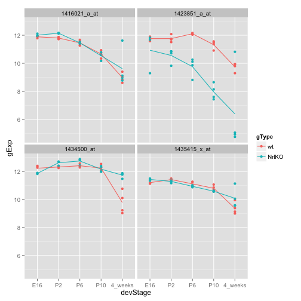

Fitting and interpreting linear models (high volume)
====================================================


```r
library(limma)
library(ggplot2) 
library(lattice)
library(reshape) # for the function melt
```

```
## Loading required package: plyr
## 
## Attaching package: 'reshape'
## 
## The following objects are masked from 'package:plyr':
## 
##     rename, round_any
```

```r
library(plyr)
prDat <- read.table("../data/photoRec/GSE4051_data.tsv")
str(prDat, max.level = 0)
```

```
## 'data.frame':	29949 obs. of  39 variables:
```

```r
prDes <- readRDS("../data/photoRec/GSE4051_design.rds")
str(prDes)
```

```
## 'data.frame':	39 obs. of  4 variables:
##  $ sidChar : chr  "Sample_20" "Sample_21" "Sample_22" "Sample_23" ...
##  $ sidNum  : num  20 21 22 23 16 17 6 24 25 26 ...
##  $ devStage: Factor w/ 5 levels "E16","P2","P6",..: 1 1 1 1 1 1 1 2 2 2 ...
##  $ gType   : Factor w/ 2 levels "wt","NrlKO": 1 1 1 1 2 2 2 1 1 1 ...
```

```r
library(VennDiagram)
```

```
## Loading required package: grid
```


## Write a function to prepare a mini-dataset for a small number of genes


```r
prepareData <- function(genes, finishing=NULL){
  jDat <- prDat[genes, prDes$sidChar]
  newDat <- cbind(prDes, t(jDat))
  
  # in case of multiple probes selected
  newDat <- melt(newDat,
                 measure.vars=grep("_at", colnames(newDat), value=TRUE))
  newDat <- rename(newDat, c("value"="gExp",
                             "variable"="gene"))  # rename column
  
  # some finishing touch to the data before returning
  if(!is.null(finishing)){
    newDat <- finishing(newDat)
  }
  return(newDat)
}
```


```r
# a function to stripplot a mini-dataset
makeStripplot <- function(myDat, ...) {
  p <- ggplot(myDat, 
              aes(x=devStage, y=gExp, color=gType, group=gType))
  p <- p + facet_wrap(~gene) + geom_point() 
  p <- p + stat_summary(fun.y=mean, geom="line")
  # p <- p + geom_line(stat = "summary", fun.y = mean)  # alternatively
  return(p)
}
```


## The difficulty in estimating gene-wise variance
  
Before we dive in and start using `limma` with the `photoRec` dataset, let's do a small simulation to illustrate how lousy variance estimates can be when the number of samples is small.

Let's simulate data for 1000 genes. For each gene, we get 3 observations from a normal distribution with mean 0 and variance 1. We generate the data for each gene independent of the others.


```r
m <- 1000
n <- 3
x <- matrix(rnorm(m * n), nrow = m)
```


Let's take the observed gene-wise variances. Yes, folks, we are estimating variance with samples of size 3. People do this all the time -- remember the video? We inspect them a bit numerically and graphically.


```r
obsVars <- apply(x, 1, var)
summary(obsVars)
```

```
##    Min. 1st Qu.  Median    Mean 3rd Qu.    Max. 
##   0.001   0.301   0.724   1.020   1.440   7.660
```

```r
densityplot(~ obsVars, n = 200)
```

 


Notice how many of the observed variances are freakishly small (and freakishly large!), even though they are indeed equal to 1 "on average". For example, we see that at least a quarter of the genes appear to exhibit a sample variance that is less than one-third the true variance. This can wreak havoc with statistical inference, such as t-statistics. This is what `limma` -- or the statistical methods it embodies, actually -- is designed to combat.

Optional take-home exercise: Make the above simulation more realistic with two (or more) groups, different data-generating means and group differences, different data-generating gene-wise variances, etc.


```r
m <- 1000  # simulate 1000 genes
nGroup <- 4
groupSize <- m / nGroup
nSample <- 3
(groupMeans <- rnorm(nGroup, 0, 5))
```

```
## [1] -7.163 -1.525 -8.193 -3.102
```

```r
x2 <- ldply(groupMeans, function(mu){
  matrix(rnorm(groupSize * nSample, mean=mu), 
         nrow = groupSize)
})
```


```r
obsVars2 <- apply(x2, 1, var)
summary(obsVars2)
```

```
##    Min. 1st Qu.  Median    Mean 3rd Qu.    Max. 
##   0.001   0.277   0.660   0.979   1.340   8.520
```

```r
densityplot(~ obsVars2, n = 200)
```

 


## Fit a linear model: explain gene expression in the wild type mice as a function of developmental stage (one-way ANOVA)

Let's just work with the wild type data.


```r
wtDes <- subset(prDes, gType == "wt")
wtDat <- subset(prDat, select = prDes$gType == "wt")
str(wtDat, max.level = 0)
```

```
## 'data.frame':	29949 obs. of  20 variables:
```


```r
(wtDes <- droplevels(wtDes))  # not necessary here, but better get into habit of doing it
```

```
##      sidChar sidNum devStage gType
## 12 Sample_20     20      E16    wt
## 13 Sample_21     21      E16    wt
## 14 Sample_22     22      E16    wt
## 15 Sample_23     23      E16    wt
## 28 Sample_24     24       P2    wt
## 29 Sample_25     25       P2    wt
## 30 Sample_26     26       P2    wt
## 31 Sample_27     27       P2    wt
## 36 Sample_28     28       P6    wt
## 37 Sample_29     29       P6    wt
## 38 Sample_30     30       P6    wt
## 39 Sample_31     31       P6    wt
## 20 Sample_32     32      P10    wt
## 21 Sample_33     33      P10    wt
## 22 Sample_34     34      P10    wt
## 23 Sample_35     35      P10    wt
## 5  Sample_36     36  4_weeks    wt
## 6  Sample_37     37  4_weeks    wt
## 7  Sample_38     38  4_weeks    wt
## 8  Sample_39     39  4_weeks    wt
```

```r
(wtDesMat <- model.matrix(~ devStage, wtDes))
```

```
##    (Intercept) devStageP2 devStageP6 devStageP10 devStage4_weeks
## 12           1          0          0           0               0
## 13           1          0          0           0               0
## 14           1          0          0           0               0
## 15           1          0          0           0               0
## 28           1          1          0           0               0
## 29           1          1          0           0               0
## 30           1          1          0           0               0
## 31           1          1          0           0               0
## 36           1          0          1           0               0
## 37           1          0          1           0               0
## 38           1          0          1           0               0
## 39           1          0          1           0               0
## 20           1          0          0           1               0
## 21           1          0          0           1               0
## 22           1          0          0           1               0
## 23           1          0          0           1               0
## 5            1          0          0           0               1
## 6            1          0          0           0               1
## 7            1          0          0           0               1
## 8            1          0          0           0               1
## attr(,"assign")
## [1] 0 1 1 1 1
## attr(,"contrasts")
## attr(,"contrasts")$devStage
## [1] "contr.treatment"
```


```r
wtFit <- lmFit(wtDat, wtDesMat)
wtEbFit <- eBayes(wtFit)
```


The first thing we might ask is "which genes show differential expression over the course of development"? 


```r
dsHits <- topTable(wtEbFit, coef=grep("devStage", colnames(wtDesMat)),
         p.value=1e-5, number=Inf)
```


```r
makeStripplot(prepareData(rownames(dsHits)[c(3, 6, 9)],
                          finishing=function(x){subset(x, gType=="wt")}))
```

 


Consider the effects associated with developmental stages P2 and P10. Scatterplot the t statistics for the test that the P2 effect is zero against that for P10.

```r
P2tt <- topTable(wtEbFit, coef = "devStageP2", n = Inf, sort = "none")
P10tt <- topTable(wtEbFit, coef = "devStageP10", n = Inf, sort = "none")
# names(P2tt) <- paste("P2", names(P2tt), sep=".")
# names(P10tt) <- paste("P10", names(P10tt), sep=".")

splom(cbind(P2.t=P2tt$t, P10.t=P10tt$t), panel=panel.smoothScatter)
```

```
## KernSmooth 2.23 loaded
## Copyright M. P. Wand 1997-2009
## (loaded the KernSmooth namespace)
```

 


Create a densityplot of the associated adjusted p-values, so you can get a sense of which developmental stage, P2 or P10, is more clearly distinguished from baseline E16.


```r
tt2and10 <- rbind(cbind(P2tt, effect="P2", probe=rownames(P2tt)),
                  cbind(P10tt, effect="P10", probe=rownames(P10tt)))
ggplot(tt2and10, aes(x=adj.P.Val, group=effect, color=effect)) + 
  geom_density()
```

 


Is this what you'd expect? Yes, P10 is further away from E16 devStage used as intercept.

If you require a BH adjusted p-value less than 1e-03, how many hits do you get for P2? How many for P10? How much overlap is there?


```r
hits2and10 <- subset(tt2and10, adj.P.Val<1e-3)
hitGenes <- dlply(hits2and10, ~effect, function(x){x$probe})

# Start a new plot
plot.new()

# Draw the Venn diagram. Note the argument `filename=NULL` tells it to
# create a plot object instead of outputting to file.
venn.plot <- venn.diagram(hitGenes, filename = NULL, 
                          fill = c("blue", "yellow"))

# Draw the plot on the screen.
grid.draw(venn.plot)
```

 


Now just focus on the P10 effect. Create a scatterplot matrix of raw p-values, BH adjusted p-values, and BY p-values.


```r
P10pVals <- data.frame(raw = P10tt$P.Value,
                       BH = P10tt$adj.P.Val,
                       BY = p.adjust(P10tt$P.Value, method = "BY"))
splom(P10pVals,
      panel = function(x, y, ... ) {
          panel.xyplot(x, y, pch = ".", ...)
          panel.smoothScatter(x,y)
          panel.abline(a = 0, b = 1, col = "orange")
      })
```

 


## Perform inference for some contrasts

Let's try to distinguish genes that have stable expression at the last three developmental stages (P6, P10, and 4_weeks) from those that do not. If expression doesn't change from P6 to P10 to 4_weeks, then the effects for all 3 of those developmental stages should be the same. That means that the difference between the P10 and P6 effects is zero and ditto for the difference between 4_weeks effect and P10 (or P6, for that matter). Let's form these contrasts.

```r
colnames(wtDesMat)
```

```
## [1] "(Intercept)"     "devStageP2"      "devStageP6"      "devStageP10"    
## [5] "devStage4_weeks"
```

```r
(cont.matrix <- makeContrasts(
    P10VsP6 = devStageP10 - devStageP6,
    fourweeksVsP10 = devStage4_weeks - devStageP10,
    levels = wtDesMat))
```

```
## Warning: Renaming (Intercept) to Intercept
```

```
##                  Contrasts
## Levels            P10VsP6 fourweeksVsP10
##   Intercept             0              0
##   devStageP2            0              0
##   devStageP6           -1              0
##   devStageP10           1             -1
##   devStage4_weeks       0              1
```

```r
wtFitCont <- contrasts.fit(wtFit, cont.matrix)
```

```
## Warning: row names of contrasts don't match col names of coefficients
```

```r
wtEbFitCont <- eBayes(wtFitCont)
```

What does `topTable()` do with our contrasts?

Something like using the previous fitted model to get new parameters and statistics based on some transformations.

The top hits are probes where there is big change from P6 to P10, from P10 to 4_weeks, or both. Let's check that by plotting the data from the top 4 hits.


```r
hits0 <- topTable(wtEbFitCont)
makeStripplot(prepareData(rownames(hits0)[1:4]))
```

 


So far, so good. These 4 probes show little expression change from P6 to P10 and a strong increase from P10 to 4_weeks. I would like to find some where there's a change in each case but perhaps in opposite direction. Let's press on.

Let's use `decideTests()` to adjust the p-values for both contrasts globally, i.e. all together and then threshhold them at a cutoff of 1e-04.

```r
cutoff <- 1e-04
wtResCont <- decideTests(wtEbFitCont, p.value = cutoff, method = "global")
summary(wtResCont)
```

```
##    P10VsP6 fourweeksVsP10
## -1       4              8
## 0    29945          29895
## 1        0             46
```

We see there are 4 probes that go down from P6 to P10 and no hits going the other way. There are 8 probes that go down from P10 to 4_weeks and 46 going the other way. Let's try to pull out various hits and plot their data.

Here are the 4 that decline from P6 to P10.

```r
(hits1 <- rownames(prDat)[wtResCont[, "P10VsP6"] < 0])
```

```
## [1] "1416635_at" "1437781_at" "1454752_at" "1455260_at"
```

```r
makeStripplot(prepareData(hits1))
```

 


Here are 4 of the 8 that decline from P10 to 4_weeks.

```r
(hits2 <- rownames(prDat)[wtResCont[, "fourweeksVsP10"] < 0])
```

```
## [1] "1416021_a_at" "1423851_a_at" "1434500_at"   "1435415_x_at"
## [5] "1437502_x_at" "1448182_a_at" "1452679_at"   "1455447_at"
```

```r
makeStripplot(prepareData(hits2[1:4]))
```

 


Is there any overlap between these probes?

```r
intersect(hits1, hits2)
```

```
## character(0)
```

Apparently not.

Here are 4 of the 46 that increase from P10 to 4_weeks.


```r
(hits3 <- rownames(prDat)[wtResCont[, "fourweeksVsP10"] > 0])
```

```
##  [1] "1416041_at"   "1417280_at"   "1418406_at"   "1418710_at"  
##  [5] "1418789_at"   "1419069_at"   "1420725_at"   "1420726_x_at"
##  [9] "1421061_at"   "1421818_at"   "1422612_at"   "1424852_at"  
## [13] "1424895_at"   "1425222_x_at" "1426059_at"   "1426223_at"  
## [17] "1427388_at"   "1428763_at"   "1429394_at"   "1429791_at"  
## [21] "1430580_at"   "1431174_at"   "1433699_at"   "1434297_at"  
## [25] "1434573_at"   "1435436_at"   "1435679_at"   "1435727_s_at"
## [29] "1436265_at"   "1436287_at"   "1440402_at"   "1440645_at"  
## [33] "1441518_at"   "1442243_at"   "1443252_at"   "1446484_at"  
## [37] "1449170_at"   "1449393_at"   "1451042_a_at" "1451635_at"  
## [41] "1452243_at"   "1453385_at"   "1455493_at"   "1457878_at"  
## [45] "1458418_at"   "1459904_at"
```

```r
stripplotIt(prepareData(hits3[1:4]))
```

```
## Error: could not find function "stripplotIt"
```


Is there any overlap between these probes and the previous "down" hits?


```r
intersect(hits1, hits3)
```

```
## character(0)
```

```r
intersect(hits2, hits3)
```

```
## character(0)
```


## Take-home exercise

See if you can find one or more probes that have some expression changes up to P6 and then hold steady all the way to 4_weeks. 

```r
# identify changes up to P6
colnames(wtDesMat)
```

```
## [1] "(Intercept)"     "devStageP2"      "devStageP6"      "devStageP10"    
## [5] "devStage4_weeks"
```

```r
(cont.matrix2 <- makeContrasts(
    P2VsE16 = devStageP2,
    P6VsP2 = devStageP6 - devStageP2,
    P6VsE16 = devStageP6,
    levels = wtDesMat))
```

```
## Warning: Renaming (Intercept) to Intercept
```

```
##                  Contrasts
## Levels            P2VsE16 P6VsP2 P6VsE16
##   Intercept             0      0       0
##   devStageP2            1     -1       0
##   devStageP6            0      1       1
##   devStageP10           0      0       0
##   devStage4_weeks       0      0       0
```

```r
wtFitCont2 <- contrasts.fit(wtFit, cont.matrix2)
```

```
## Warning: row names of contrasts don't match col names of coefficients
```

```r
wtEbFitCont2 <- eBayes(wtFitCont2)

hits20 <- topTable(wtEbFitCont2)
makeStripplot(prepareData(rownames(hits20)[1:4]))
```

 


Let's use `decideTests()` to adjust the p-values for both contrasts globally, i.e. all together and then threshhold them

```r
cutoff <- 1e-04
wtResCont2 <- decideTests(wtEbFitCont2, p.value = cutoff, method = "global")
summary(wtResCont2)
```

```
##    P2VsE16 P6VsP2 P6VsE16
## -1      21      0      39
## 0    29928  29949   29898
## 1        0      0      12
```


probes that have some expression changes up to P6:

```r
changed <- which(rowSums(abs(wtResCont2)) > 0)

(hits21 <- rownames(prDat)[changed][1:4])
```

```
## [1] "1415964_at"   "1416251_at"   "1417184_s_at" "1417288_at"
```

```r
makeStripplot(prepareData(hits21))
```

 


probes that hold steady between P5 all the way to 4_weeks:

```r
wtResCont3 <- decideTests(wtEbFitCont2, p.value = 1e-2, method = "global")
summary(wtResCont3)
```

```
##    P2VsE16 P6VsP2 P6VsE16
## -1     197      7     372
## 0    29746  29916   29516
## 1        6     26      61
```

```r
steadyLater <- which(rowSums(abs(wtResCont3)) == 0)
```


```r
intersect(changed, steadyLater)
```

```
## integer(0)
```


